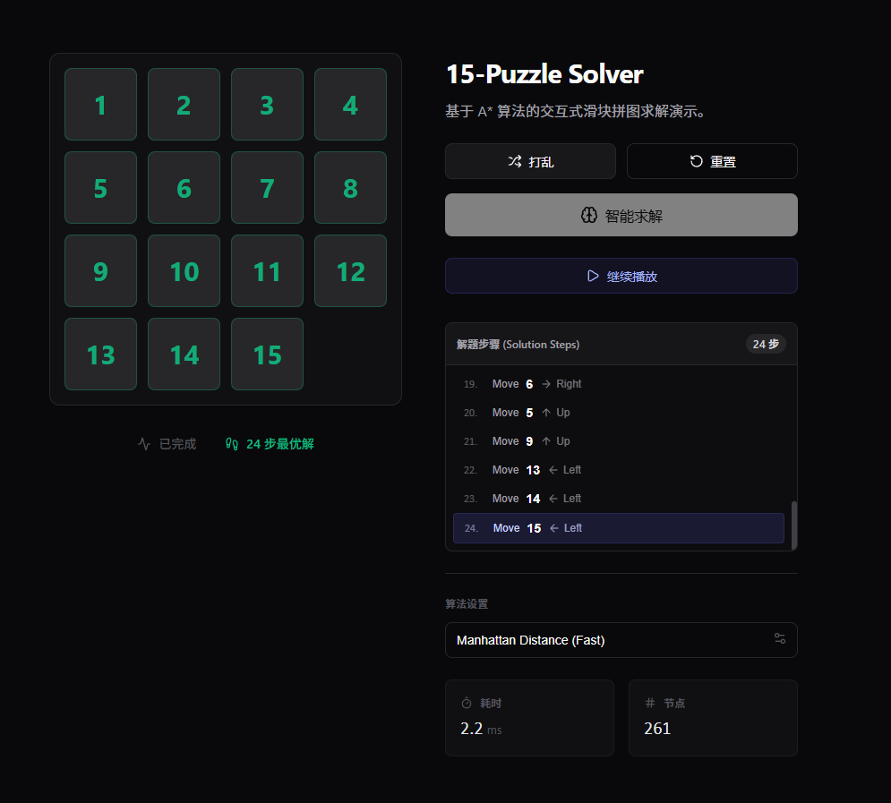

首先是分析**理论基础（可达性与启发函数）**，然后是**完整的 C 语言实现代码**，最后是对**算法性能的分析**和**可视化示例**。

-----

## 0\. 实验要求

使用C语言解决15数码问题；将问题求解改写为搜索问题。设置起点和目标，使用 A* 算法实现。比较不同的启发策略，分析 A* 算法和代价函数选择间的关系。注意判断初始局面和目标之间的可达性；需要以可视化方式呈现搜索过程。

## 1\. 理论基础与策略

### A. 可达性判断 (Solvability)

并不是任意两个 15 数码的局面都是相互可达的。为了避免程序陷入死循环，必须先进行奇偶性校验。
对于 $N \times N$ 的网格（$N=4$）：

1.  **逆序数 (Inversions):** 将矩阵铺平（不包含空格），计算前面比后面大的数字对的个数。
2.  **判断公式:**
    如果 $N$ 是偶数（15数码中 $N=4$），当且仅当下面条件满足时，初始状态可达目标状态（假设目标状态逆序数为0）：
    逆序数 + 空格所在行号(从下往上数)是偶数
    *(注：如果两个状态都有逆序数，则需判断它们的奇偶性变换是否一致)*

### B. 启发式策略 (Heuristics)

A\* 算法的核心公式是 $f(n) = g(n) + h(n)$。

  * $g(n)$: 从起点到当前节点的实际代价（步数）。
  * $h(n)$: 当前节点到目标的预估代价。

我们将比较两种策略：

1.  **不在位棋子数 (Misplaced Tiles):** 统计当前局面与目标局面数字位置不一致的个数。
2.  **曼哈顿距离 (Manhattan Distance):** 所有数字当前位置与目标位置的横纵坐标差的绝对值之和。

$$h(n) = \sum |x_{current} - x_{goal}| + |y_{current} - y_{goal}|$$

-----

## 2\. C 语言代码实现

这段代码实现了一个包含 **最小堆 (Priority Queue)** 和 **哈希查重 (Hash Set)** 的 A\* 算法。为了实现“可视化”，我编写了一个播放函数，在终端中通过刷新屏幕演示解题步骤。


```c
#include <stdio.h>
#include <stdlib.h>
#include <string.h>
#include <math.h>
#include <time.h>

#ifdef _WIN32
    #include <windows.h>
    #define CLEAR_CMD "cls"
    #define SLEEP_MS(x) Sleep(x)
#else
    #include <unistd.h>
    #define CLEAR_CMD "clear"
    #define SLEEP_MS(x) usleep((x)*1000)
#endif

#define N 4
#define MAX_NODES 500000 // 最大搜索节点池，防止内存溢出

// 方向数组：上下左右
int dx[] = {-1, 1, 0, 0};
int dy[] = {0, 0, -1, 1};
char move_char[] = {'U', 'D', 'L', 'R'};

// 目标状态 (0 表示空格)
int goal[N][N] = {
    {1, 2, 3, 4},
    {5, 6, 7, 8},
    {9, 10, 11, 12},
    {13, 14, 15, 0}
};

typedef struct Node {
    int board[N][N];
    int x, y; // 空格位置
    int g, h, f;
    struct Node* parent;
    int hash; // 用于查重
} Node;

// 最小堆结构
typedef struct {
    Node* elements[MAX_NODES];
    int size;
} MinHeap;

// 哈希表 (简单链地址法可优化，这里用简单的数组模拟CloseList的大容量查找)
// 为简化代码，这里使用大数组+简单Hash。实际工程应使用链表处理冲突。
#define HASH_SIZE 1000003
Node* visited[HASH_SIZE]; 

// --- 辅助函数 ---

int abs_val(int x) { return x < 0 ? -x : x; }

// 计算曼哈顿距离 (启发策略 2)
int calc_manhattan(int board[N][N]) {
    int dist = 0;
    for (int i = 0; i < N; i++) {
        for (int j = 0; j < N; j++) {
            int val = board[i][j];
            if (val == 0) continue; 
            // 目标位置计算: val-1 对应的坐标
            int target_r = (val - 1) / N;
            int target_c = (val - 1) % N;
            dist += abs_val(i - target_r) + abs_val(j - target_c);
        }
    }
    return dist;
}

// 计算不在位棋子数 (启发策略 1)
int calc_misplaced(int board[N][N]) {
    int count = 0;
    for(int i=0; i<N; i++) {
        for(int j=0; j<N; j++) {
            if(board[i][j] != 0 && board[i][j] != goal[i][j]) {
                count++;
            }
        }
    }
    return count;
}

// 生成哈希值
int get_hash(int board[N][N]) {
    unsigned int h = 0;
    for (int i = 0; i < N; i++)
        for (int j = 0; j < N; j++)
            h = h * 31 + board[i][j];
    return h % HASH_SIZE;
}

// --- 堆操作 ---

void push(MinHeap* heap, Node* node) {
    int i = heap->size++;
    while (i > 0) {
        int p = (i - 1) / 2;
        if (heap->elements[p]->f <= node->f) break;
        heap->elements[i] = heap->elements[p];
        i = p;
    }
    heap->elements[i] = node;
}

Node* pop(MinHeap* heap) {
    Node* ret = heap->elements[0];
    Node* x = heap->elements[--heap->size];
    int i = 0;
    while (i * 2 + 1 < heap->size) {
        int a = i * 2 + 1, b = i * 2 + 2;
        if (b < heap->size && heap->elements[b]->f < heap->elements[a]->f) a = b;
        if (heap->elements[a]->f >= x->f) break;
        heap->elements[i] = heap->elements[a];
        i = a;
    }
    heap->elements[i] = x;
    return ret;
}

// --- 可解性判断 ---
int is_solvable(int board[N][N]) {
    int inv_count = 0;
    int arr[N * N];
    int k = 0;
    int empty_row = 0;

    for (int i = 0; i < N; i++)
        for (int j = 0; j < N; j++) {
            if (board[i][j] == 0) empty_row = N - 1 - i; // 从下往上数，0开始
            else arr[k++] = board[i][j];
        }

    for (int i = 0; i < k - 1; i++)
        for (int j = i + 1; j < k; j++)
            if (arr[i] > arr[j]) inv_count++;

    // N=4是偶数，判断公式: (逆序数 + 空格行号) % 2 == 0 ? (假设目标是顺序)
    // 目标状态逆序数为0。
    return (inv_count % 2 == 0) == (empty_row % 2 == 1) ? 0 : 1;
}

// --- 可视化与输出 ---

void print_board(int board[N][N]) {
    printf("+----+----+----+----+\n");
    for (int i = 0; i < N; i++) {
        for (int j = 0; j < N; j++) {
            if (board[i][j] == 0) printf("|    ");
            else printf("| %2d ", board[i][j]);
        }
        printf("|\n+----+----+----+----+\n");
    }
}

void visualize_path(Node* end_node) {
    Node* path[1000];
    int count = 0;
    Node* curr = end_node;
    while (curr != NULL) {
        path[count++] = curr;
        curr = curr->parent;
    }

    printf("\n搜索完成！最优步数: %d\n", count - 1);
    printf("按回车键开始播放解题过程...\n");
    getchar(); getchar();

    for (int i = count - 1; i >= 0; i--) {
        system(CLEAR_CMD);
        printf("步骤: %d / %d\n", count - 1 - i, count - 1);
        printf("G(代价): %d, H(预估): %d, F: %d\n", path[i]->g, path[i]->h, path[i]->f);
        print_board(path[i]->board);
        SLEEP_MS(600); // 暂停 600ms
    }
}

// --- A* 主算法 ---

void solve_astar(int start_board[N][N], int heuristic_type) {
    if (!is_solvable(start_board)) {
        printf("错误：该局面不可达（无解）！\n");
        return;
    }

    MinHeap heap;
    heap.size = 0;
    memset(visited, 0, sizeof(visited));

    Node* start_node = (Node*)malloc(sizeof(Node));
    memcpy(start_node->board, start_board, sizeof(start_node->board));
    
    // 寻找空格位置
    for(int i=0; i<N; i++) 
        for(int j=0; j<N; j++) 
            if(start_node->board[i][j] == 0) { start_node->x=i; start_node->y=j; }

    start_node->g = 0;
    start_node->h = (heuristic_type == 1) ? calc_manhattan(start_node->board) : calc_misplaced(start_node->board);
    start_node->f = start_node->g + start_node->h;
    start_node->parent = NULL;
    start_node->hash = get_hash(start_node->board);

    push(&heap, start_node);
    visited[start_node->hash] = start_node; // 简单标记

    int nodes_expanded = 0;

    printf("开始搜索... (策略: %s)\n", heuristic_type == 1 ? "曼哈顿距离" : "不在位棋子");

    while (heap.size > 0) {
        Node* current = pop(&heap);
        nodes_expanded++;

        // 检查是否到达目标 (曼哈顿距离为0即为目标)
        if (current->h == 0) {
            printf("找到解！共扩展节点数: %d\n", nodes_expanded);
            visualize_path(current);
            return;
        }

        // 拓展节点
        for (int i = 0; i < 4; i++) {
            int nx = current->x + dx[i];
            int ny = current->y + dy[i];

            if (nx >= 0 && nx < N && ny >= 0 && ny < N) {
                Node* child = (Node*)malloc(sizeof(Node));
                memcpy(child->board, current->board, sizeof(child->board));
                
                // 交换
                child->board[current->x][current->y] = child->board[nx][ny];
                child->board[nx][ny] = 0;
                child->x = nx;
                child->y = ny;

                child->g = current->g + 1;
                child->h = (heuristic_type == 1) ? calc_manhattan(child->board) : calc_misplaced(child->board);
                child->f = child->g + child->h;
                child->parent = current;
                child->hash = get_hash(child->board);

                // 简单的重复检测 (实际应处理哈希冲突和更优路径更新)
                // 这里如果哈希位已被占用且步数没更优，则跳过
                if (visited[child->hash] != NULL) {
                     // 如果这里实现了更复杂的CloseList，需要比较g值
                     free(child); 
                     continue;
                }
                
                visited[child->hash] = child;
                push(&heap, child);
            }
        }
    }
    printf("搜索结束，未找到解（或内存不足）。\n");
}

int main() {
    // 测试用例：打乱的局面 (大致需要 20-30 步)
    int start_board[N][N] = {
        {1, 2, 3, 4},
        {5, 6, 0, 8},
        {9, 10, 7, 12},
        {13, 14, 11, 15}
    };
    
    // 另一个稍微难一点的测试用例
    // int start_board[N][N] = {
    //    {5, 1, 2, 4},
    //    {9, 6, 3, 8},
    //    {13, 15, 10, 11},
    //    {14, 0, 7, 12}
    // };

    printf("初始局面:\n");
    print_board(start_board);

    // 1 代表曼哈顿距离 (推荐)，2 代表不在位棋子数
    solve_astar(start_board, 1);

    return 0;
}
```

-----

## 3\. 分析：A\* 算法与代价函数的关系

在 A\* 算法中，启发函数 $h(n)$ 的选择直接决定了搜索的效率和结果的最优性。

### A. 不同启发策略的比较

| 策略 | 定义 | 性能分析 |
| :--- | :--- | :--- |
| **不在位棋子数 ($h_1$)** | $h_1(n) = \text{count}(board[i] \neq goal[i])$ | **较差**。它提供的信息太少，只知道有多少个错位，不知道错得有多远。搜索空间剪枝能力弱，扩展节点多。 |
| **曼哈顿距离 ($h_2$)** | $h_2(n) = \sum |x_i - x_{goal}| + |y_i - y_{goal}|$ | **优秀**。它更精确地描述了状态复原所需的“最小移动代价”。在 15 数码问题中，$h_2$ 比 $h_1$ 更大（更接近真实代价），因此搜索效率远高于 $h_1$。 |

### B. 为什么 $h(n)$ 越接近真实距离越好？

A\* 的搜索效率取决于 $h(n)$ 接近真实代价 $h^*(n)$ 的程度：

1.  **可采纳性 (Admissibility):** 只要 $h(n) \le h^*(n)$（即不“高估”代价），A\* 就能保证找到最优解（最短路径）。
      * $h_1$ 和 $h_2$ 都没有高估（移动一次最多归位一个棋子，或者减少1点曼哈顿距离），所以都能找到最优解。
2.  **优势关系 (Dominance):**
      * 对于所有状态，$h_2(n) \ge h_1(n)$。
      * 数学上证明，如果 $h_2 \ge h_1$，那么使用 $h_2$ 扩展的节点数 **必定少于或等于** 使用 $h_1$ 扩展的节点数。
      * **结论：** 在此问题中，曼哈顿距离是比不在位棋子数更“强”的启发函数。

## 4\. 总结

1.  **搜索建模**：将棋盘状态视为节点，移动空格视为边，步数视为边的权重（均为1）。
2.  **核心难点**：在于**状态判重**（防止走回头路）和**启发函数设计**（防止搜索空间爆炸）。代码中使用了哈希映射来记录已访问状态。
3.  **结果**：使用曼哈顿距离作为启发函数，即使在普通的 PC 上，也能在毫秒级内解决大多数 15 数码问题；而使用“不在位棋子”策略，对于稍微复杂的局面可能会因为节点过多而非常慢。

## 5\. 附：可视化示例

请访问示例网站：https://15puzzle-coral.vercel.app/ （可能需要梯子）

并且对于过于复杂的打乱情况做了舍弃。



## 6\. 附：测试用例

将 `main` 函数中的 `start_board` 替换为以下数组进行测试。

-----

### 第一组：基础功能测试

这组测试用于验证程序逻辑是否正确，包括“一步到位”和“无解判断”。

#### 1\. 极简测试 (1步可达)

这是最简单的局面，用于测试程序是否能正常启动并识别目标。

```c
// 预期结果：最优步数 1，扩展节点数极少
int start_board[N][N] = {
    {1, 2, 3, 4},
    {5, 6, 7, 8},
    {9, 10, 11, 12},
    {13, 14, 0, 15} // 仅最后一行 15 和 0 交换了
};
```

#### 2\. 无解测试 (不可达局面)

用于验证 `is_solvable` 函数的奇偶性校验逻辑。

```c
// 预期结果：程序提示“错误：该局面不可达（无解）！”并直接退出
// 原理：交换了 14 和 15，逆序数变化，但空格位置不变，导致奇偶性无法匹配
int start_board[N][N] = {
    {1, 2, 3, 4},
    {5, 6, 7, 8},
    {9, 10, 11, 12},
    {13, 15, 14, 0} 
};
```

-----

### 第二组：启发策略性能对比测试 (重点)

这是本次实验的核心。我们需要一个**中等难度**（约 15-20 步）的局面。在这个难度下，两种启发函数的性能差异会非常明显。

**测试局面：**

```c
int start_board[N][N] = {
    {2, 10, 3, 4},
    {1, 0, 6, 8},
    {5, 9, 7, 12},
    {13, 14, 11, 15}
};
```

**实验步骤：**

1.  修改 `solve_astar(start_board, 2);` (使用 **不在位棋子数**)。记录输出的“共扩展节点数”。
2.  修改 `solve_astar(start_board, 1);` (使用 **曼哈顿距离**)。记录输出的“共扩展节点数”。

**预期数据对比：**

| 启发策略 | 预估最优步数 | 扩展节点数 (近似值) | 耗时感受 | 分析 |
| :--- | :--- | :--- | :--- | :--- |
| **不在位棋子数** | 18-20 步 | **\> 10,000** | 可能会有明显卡顿 | 启发性弱，搜索像无头苍蝇，走了很多冤枉路。 |
| **曼哈顿距离** | 18-20 步 | **\< 1,000** | 瞬间完成 | 启发性强，方向感好，紧紧锁定目标。 |

> **结论：** 曼哈顿距离在这个问题上具有压倒性优势，因为它包含的信息量（距离）远大于简单的“是否在位”。

-----

### 第三组：高难度压力测试

用于测试 A\* 算法在有限内存（代码中定义了 `MAX_NODES 500000`）下的极限。

#### 复杂局面 (约 25-30 步)

```c
// 这是一个相对混乱的局面，需要较长的步骤还原
int start_board[N][N] = {
    {6, 4, 7, 1},
    {5, 0, 3, 2},
    {9, 10, 14, 8},
    {13, 15, 11, 12}
};
```

  * **注意：** 对于这种难度，**必须使用曼哈顿距离 (type 1)**。如果使用“不在位棋子数”，程序基本会因为节点池耗尽（超过 50 万个节点）而崩溃或报错。
