## Midjourney

- From [Kkai](https://www.bilibili.com/video/BV1GnSCBaEwr/?spm_id_from=333.337.search-card.all.click)

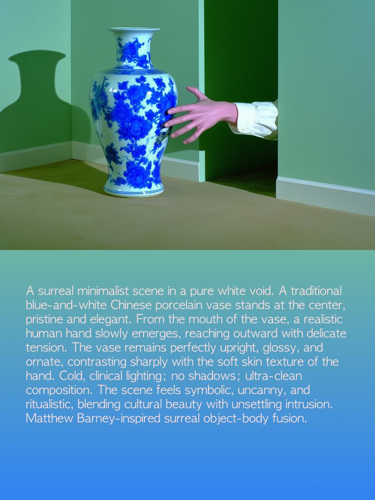

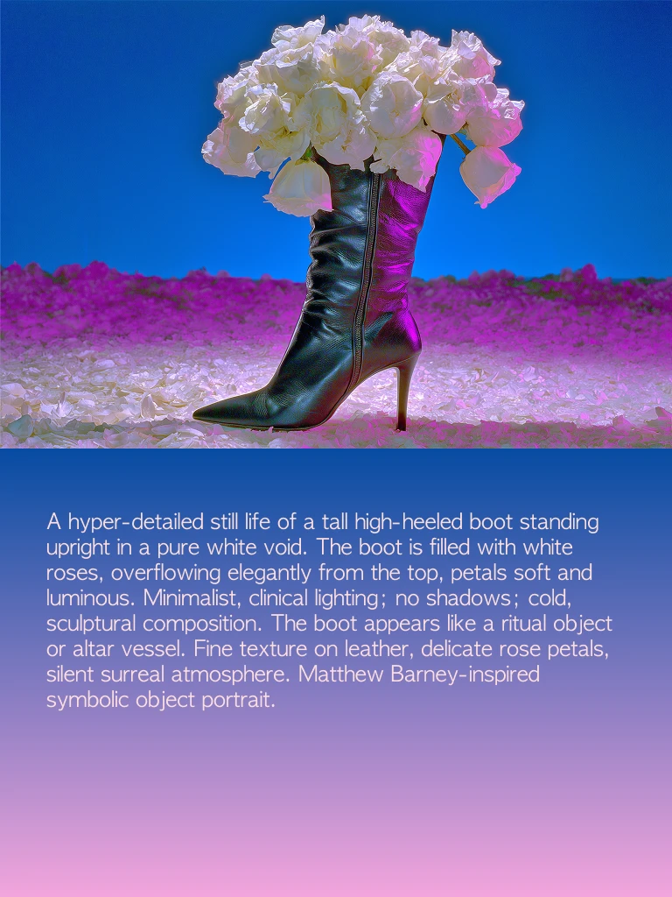

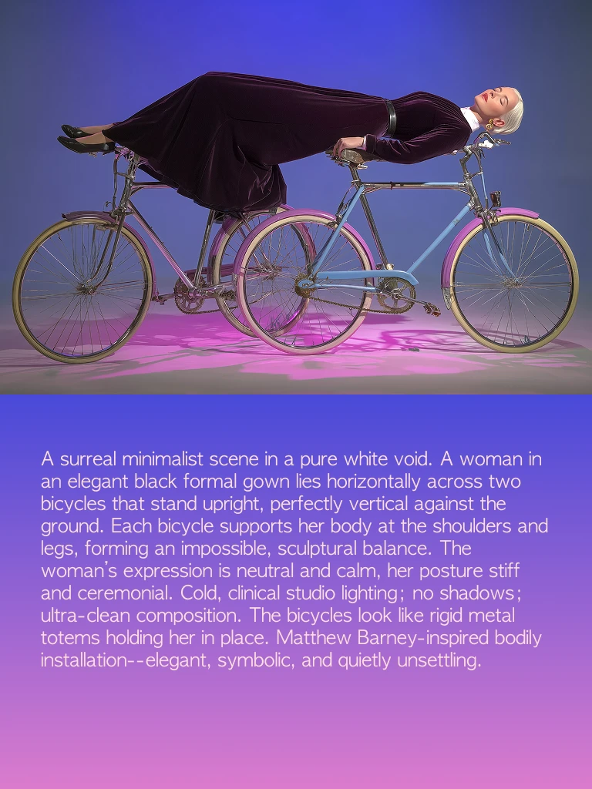

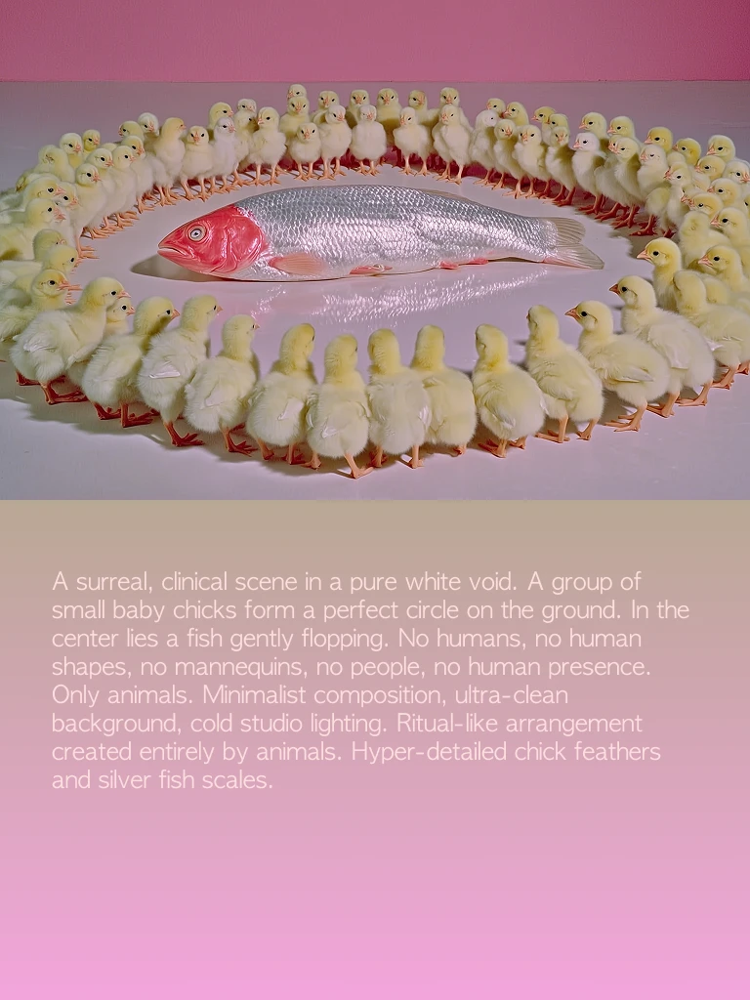

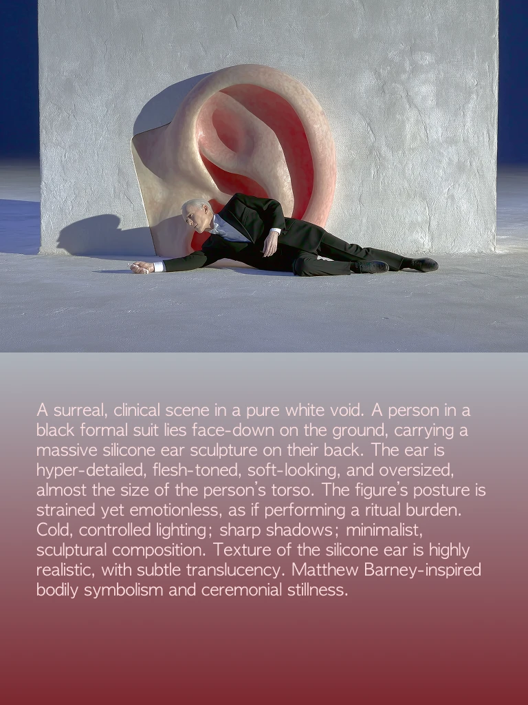

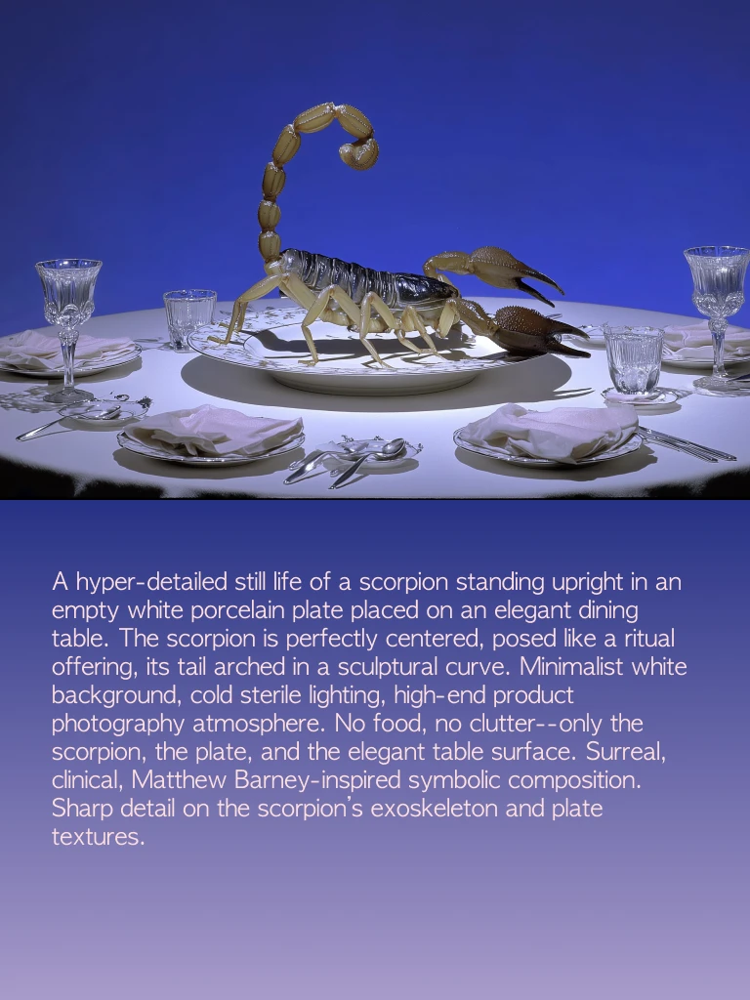

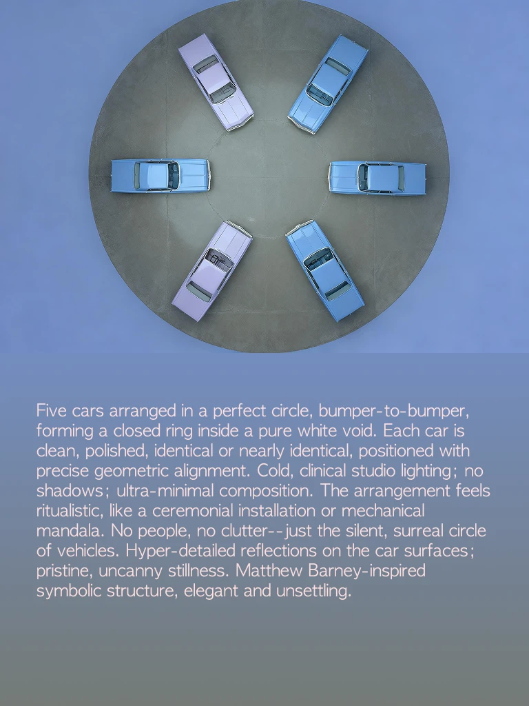

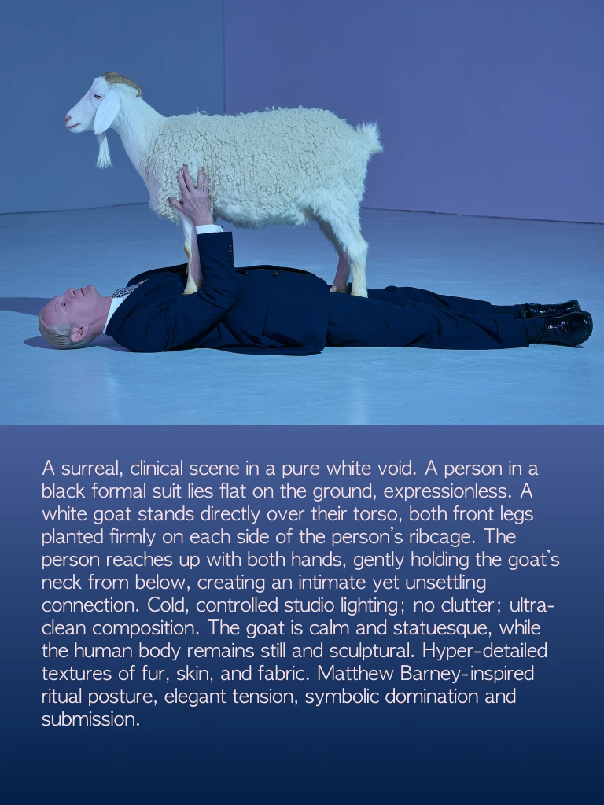

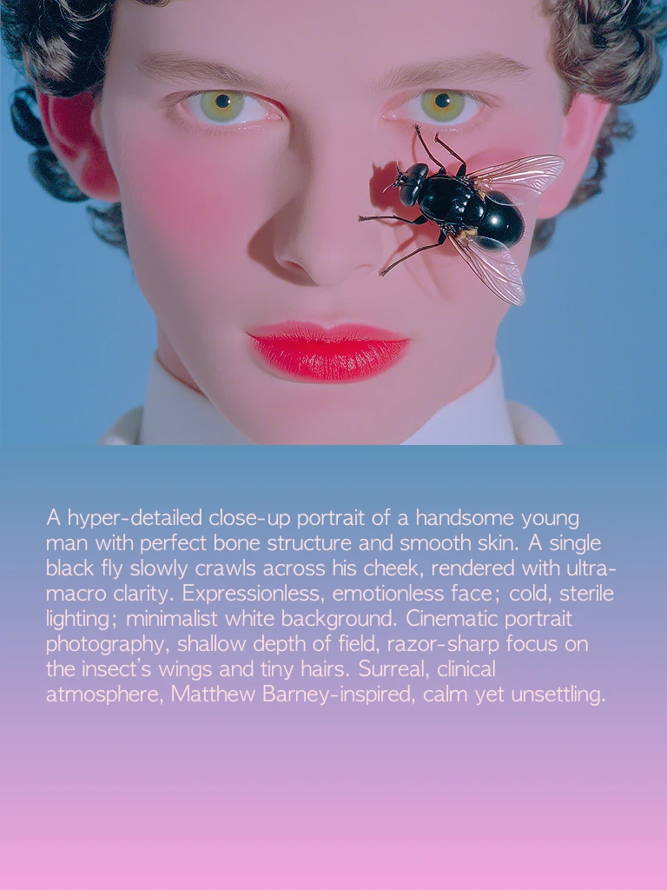

## Test in Nano Banana Pro

A surreal minimalist scene in a pure white void. A traditionablue-and-white Chinese porcelain vase stands at the centerpristine and elegant. From the mouth of the vase, a realistichuman hand slowly emerges, reaching outward with delicatetension. The vase remains perfectly upright, glossy, andornate, contrasting sharply with the soft skin texture of thehand. Cold, clinical lighting; no shadows; ultra-cleancomposition. The scene feels symbolic, uncanny, andritualistic, blending cultural beauty with unsettling intrusion.Matthew Barney-inspired surreal object-body fusion.

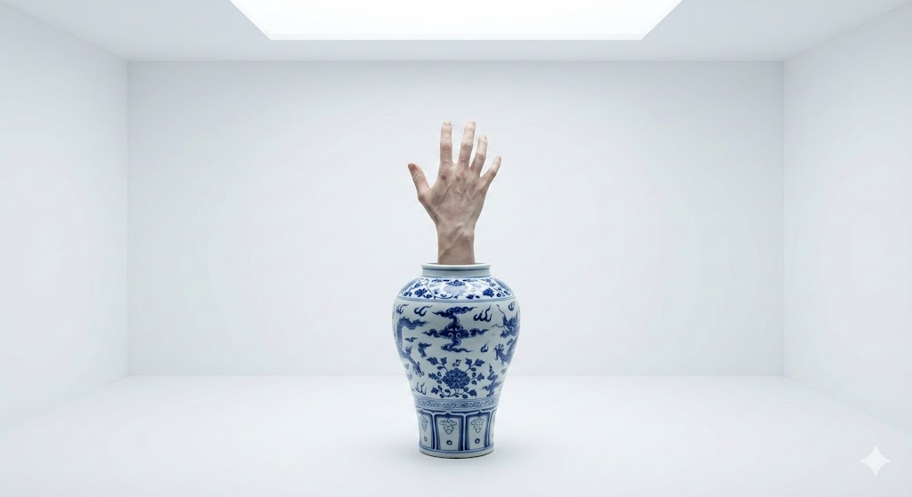

A surreal minimalist scene in a pure white void. A woman inan elegant black formal gown lies horizontally across twobicycles that stand upright, perfectly vertical against theground. Each bicycle supports her body at the shoulders andlegs, forming an impossible, sculptural balance. Thewoman's expression is neutral and calm, her posture stiffand ceremonial. Cold, clinical studio lighting; no shadows .ultra-clean composition. The bicvcles look like rigid metaltotems holding her in place. Matthew Barney-inspired bodilyinstallation--elegant, symbolic, and quietly unsettling.

A surreal, clinical scene in a pure white void. A person in ablack formal suit lies face-down on the ground, carrying amassive silicone ear sculpture on their back. The ear ishyper-detailed, flesh-toned, soft-looking, and oversizedalmost the size of the person's torso. The figure's posture isstrained yet emotionless, as if performing a ritual burden.Cold, controlled lighting;sharp shadows; minimalist,sculptural composition. Texture of the silicone ear is highlyrealistic, with subtle translucency. Matthew Barney-inspiredbodily symbolism and ceremonial stillness.

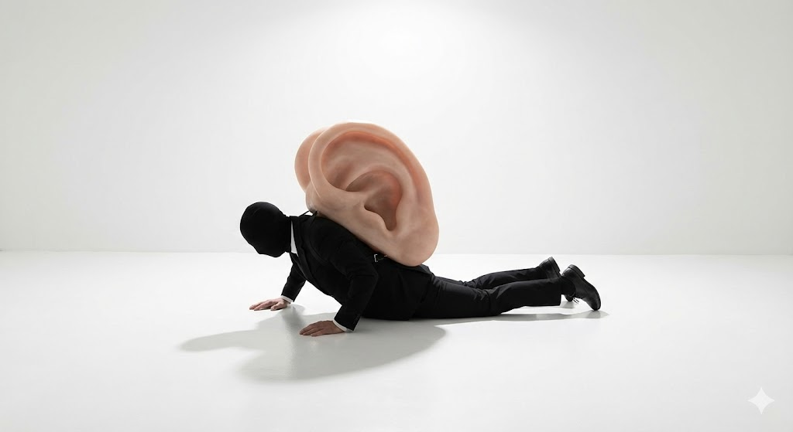

A hyper-detailed still life of a scorpion standing upright in anempty white porcelain plate placed on an elegant diningtable. The scorpion is perfectly centered, posed like a ritualoffering, its tail arched in a sculptural curve. inimalist whitebackground, cold sterile lighting, high-end productphotography atmosphere. No food, no clutter--only thescorpion, the plate, and the elegant table surface. Surrealclinical, Matthew Barney-inspired symbolic composition.Sharp detail on the scorpion's exoskeleton and platetextures.

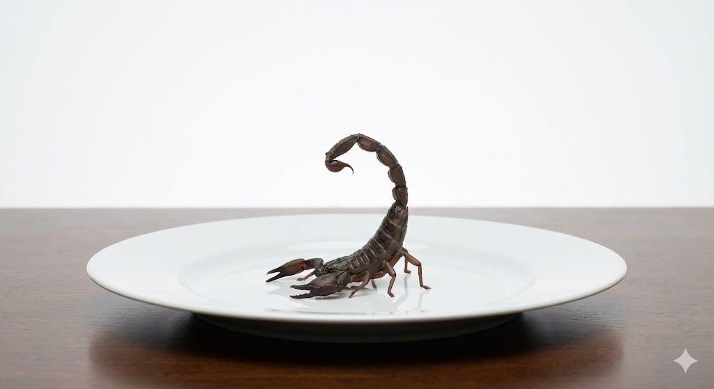

Five cars arranged in a perfect circle, bumper-to-bumperforming a closed ring inside a pure white void. Each car isclean, polished, identical or nearly identical, positioned withprecise geometric alignment. Cold, clinical studio lighting; noshadows;ultra-minimal composition. The arrangement feelsritualistic, like a ceremonial installation or mechanicalmandala. No people, no clutter--just the silent, surreal circleof vehicles. Hyper-detailed reflections on the car surfaces ;pristine,uncanny stillness. Matthew Barney-inspiredsymbolic structure, elegant and unsettling.

A surreal, clinical scene in a pure white void. A person in ablack formal suit lies flat on the ground, expressionless. Awhite goat stands directly over their torso, both front legsplanted firmly on each side of the person's ribcage. Theperson reaches up with both hands, gently holding the goat'sneck from below, creating an intimate yet unsettlingconnection. Cold, controlled studio lighting; no clutter; ultra.clean composition. The goat is calm and statuesque, whilethe human body remains still and sculptural. Hyper-detailedtextures of fur, skin, and fabric. Matthew Barney-inspiredritual posture, elegant tension, symbolic domination andsubmission.

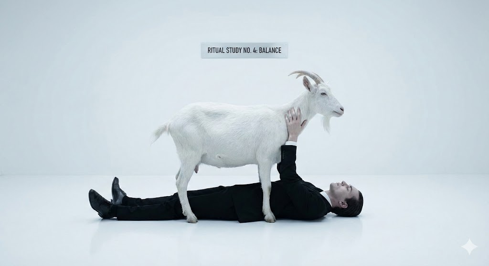

A hyper-detailed close-up portrait of a handsome youngman with perfect bone structure and smooth skin. A singleblack fly slowly crawls across his cheek, rendered with ultra-macro clarity. Expressionless, emotionless face; cold, sterilelighting; minimalist white background. Cinematic portraitphotography,shallow depth of field, razor-sharp focus onthe insect's wings and tiny hairs. Surreal, clinicalatmosphere, Matthew Barney-inspired, calm yet unsettling

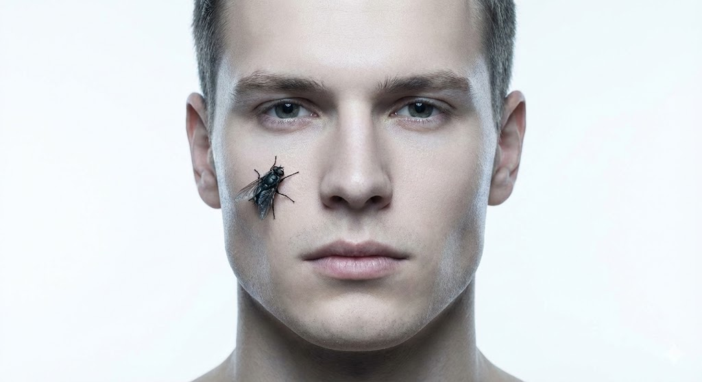

A hyper-detailed still life of a tall high-heeled boot standingupright in a pure white void. The boot is filled with whiteroses, overflowing elegantly from the top, petals soft andluminous. Minimalist, clinical lighting; no shadows; cold,sculptural composition. The boot appears like a ritual objector altar vessel. Fine texture on leather, delicate rose petals,silent surreal atmosphere. atthew Barney-inspiredsymbolic object portrait.

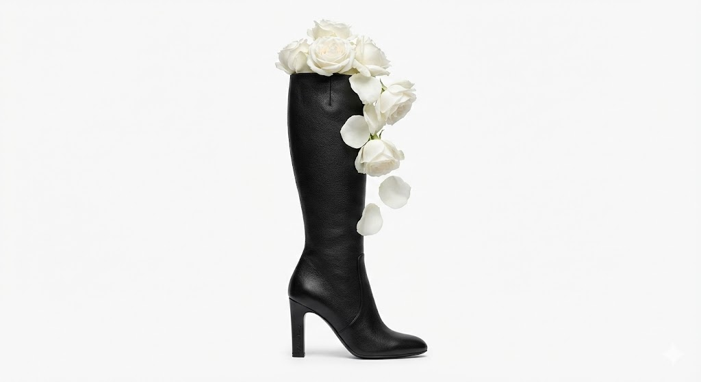

A surreal, clinical scene in a pure white void. A group ofsmall baby chicks form a perfect circle on the ground. In thecenter lies a fish gently flopping. No humans, no humanshapes, no mannequins, no people, no human presenceOnly animals.inimalist composition, ultra-cleanbackground, cold studio lighting. Ritual-like arrangementcreated entirely by animals. Hyper-detailed chick feathersand silver fish scales.

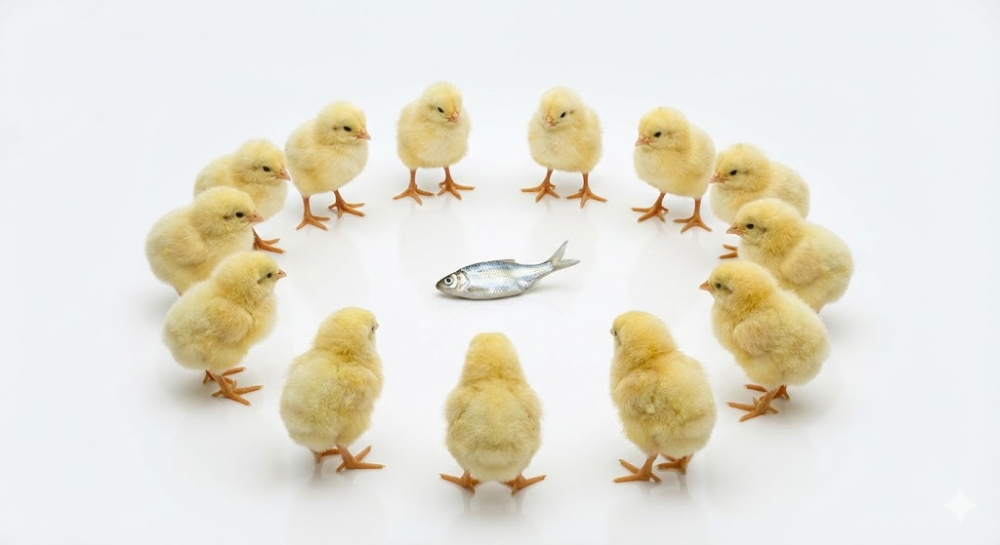

猜测 Kkai 应该在生成之前用了一个 prompt 顶了一下颜色基调，不过抛去这个因素的影响，Nano 的生成效果太拟真了，反而没有那种怪诞的感觉。