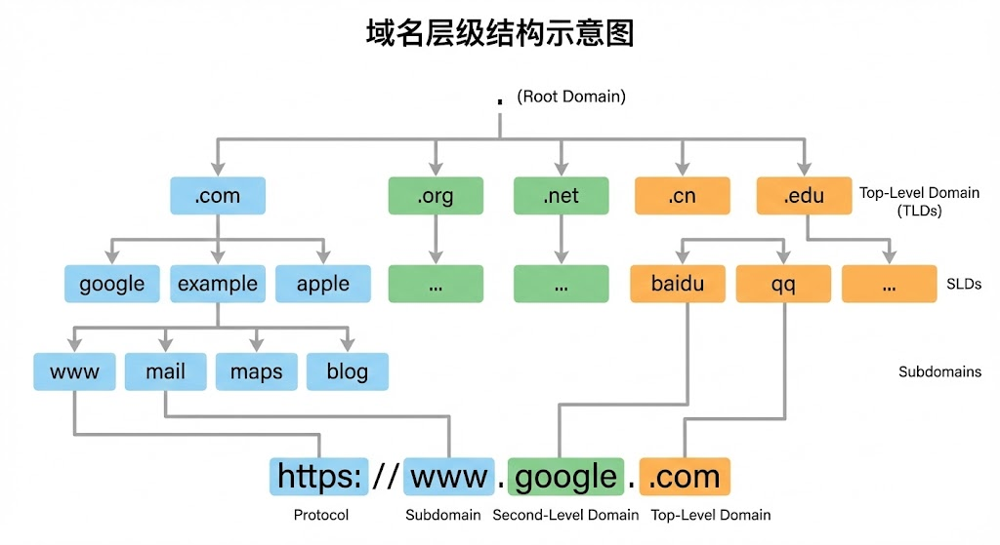

对于前端开发者来说，80%需要关注的内容都集中在 **应用层（HTTP）、传输层（TCP/IP）和性能/安全** 这几个部分，所以我们分为下面几个板块来梳理一下相关的内容。

## 从输入 URL 到页面展示发生了什么？

数据传输是网络的根本目的，所以我们有了通信这一方法，来发送/接收数据。

在相同设备上，进程间通信并非难事，科学家们提供了非常多的方案；对于不同设备上的进程通信，则需要定义一套通用网络协议防止你说洋文我说方言，保证通信规范性。于是科学家们提出了网络模型。

主流的网络模型有三种：
- OSI七层模型，由国际标准化组织ISO提出，也就是“标准”，实际上用得少，但是对于排查故障有一定参考效果
- 五层网络模型，目前教材上讲解的就是这个模型，适合教学，平衡了OSI模型和TCP/IP模型的复杂度
- TCP/IP四层模型，做更进一步的简化。

实际工作中用的更多的是TCP/IP四层模型或者五层网络模型（也说五层网络模型是更现代的TCP/IP四层模型：将四层模型的网络接口层拆分为了数据链路层和物理层，隔离了数字信号和电信号），OSI模型起到的更多是指导作用。

网络模型都是分层的，不同的层次有不同的职能。它们共同保证的数据传输的稳定性。接下来就以**TCP/IP四层模型为例**，自顶向下的梳理一下从在浏览器中输入URL网址到展示出页面的这一过程中，发生了什么。

### 各个层级的作用

接下来简单说明一下各个层级的作用：

- 应用层：我们直接能接触到的就是应用层，它通过一系列协议（http、SMTP、FTP、DNS等等），专注为用户提供功能，本身不关注数据的传输。操作系统层面，它工作在用户态，以下层级都工作在内核态。
- 传输层：传输层为应用层提供网络支持，应用层的数据会下发给传输层，并从中接受需要的数据。它包含两个协议，一个是TCP、一个是UDP：大部分应用使用TCP协议（例如http协议，由TCP保证其内容的可靠传输），它拥有许多特性例如流量控制、超时重传等等——稳定、可靠；而UDP只负责发送数据包而不管包到没到，实时性更好、传输效率更高（如果要实现类TCP的特性，其实可以从应用层上下功夫，但是相对应的开发成本不低）。
- 网络层：传输层通过端口实现应用到应用的传输，而网络层则负责设备到设备的传输。这一层通过IP协议的两个功能：寻址和路由，决定数据要去哪个设备以及怎么去到这个设备——寻址通过IP地址配合子网掩码算出起点和终点；而路由通过路由算法决定要走哪条路线。
- 网络接口层：网络层虽然能够算出起点和终点，但是对于路径中的途径点一概不知。数据在以太网中要到达需要到达的设备，则需要通过MAC地址来标识设备，从而实现数据在以太网上的传输。

下面是每一层的封装格式：

网络分层中的数据传输单位在不同层级有不同的名称：

1. **HTTP层（应用层）**：消息/报文（message）
2. **TCP层（传输层）**：段（segment）
3. **IP层（网络层）**：包（packet）
4. **网络接口层（链路层）**：帧（frame）

这些术语反映了数据在不同层级封装时的形态变化，但本质上都是数据包的某种形式。在实际讨论中，这些名词常被统称为“数据包”。

### 当键入网址后，到网页显示，其间发生了什么

一个相当经典的前端面试题，不过很有价值。接下来以一个简单的网络拓扑模型（客户端说“我要请求这个数据”；服务器说“OK发给你”），来探究一下整个过程：

#### step 1：解析URL

计算机领域中很多表达式都需要翻译或者解析才能被计算机看懂，URL也不例外。所以首先需要做的就是解析用户输入的URL，从而才能生成发送给web服务器的请求信息。小林coding的这张图很好的解释了URL的含义：

从上图可以看出，URL（中文名为统一资源定位器）实际上请求的就是服务器中的特定文件资源——也就是两个信息：请求的是哪个服务器、请求的是这个服务器下的哪个资源（特殊的，当省略了路径名时，请求的是当前服务器下的默认资源，如前端常见的index.html）。

根据这两个信息，就能生成HTTP请求信息了（有关HTTP的具体内容见下一部分）：

#### step2：查询真实地址

在解析URL并生成HTTP请求信息后，下一部分工作则需要浏览器移交到操作系统将消息发送到服务器。但是在此之前，必须将通信对象的IP地址提供给操作系统：

这也就是第二步的目的：根据URL，找到对应的IP地址。

但是茫茫多的域名和IP，如果逐条对比无异于是大海捞针。DNS服务器在这个时候就大显神威了——它起到了一个类似于电话本的作用，专门保存了web服务器和IP地址的对应关系。

如果只是将对应关系一条条的列出来，那不还是没有解决问题吗？于是DNS采用了树的结构：以 `www.server.com` 为例，全名应该为 `www.server.com.` 从左到右层级越高，也就是：

- `.` 最高
- `.com` 次之
- ···

以图示意之：

同时，根域的DNS服务器信息存在于所有DNS服务器中，这就能使客户端”从上到下、顺藤摸瓜“找到需求的DNS服务器。

但如果每次都需要请求DNS服务器，成本就比较大。自然而然地，科学家就引入了缓存来简化工作流。从浏览器缓存、操作系统缓存、host文件逐步向外查找，如果都找不到，就找DNS解决。

#### step3：准备发包

上面的两步其实就是对包做了点修饰，提供了一点信息给它，但是并不具备发包的能力，这就需要委托操作系统中的协议栈来帮忙传输：

这是比较具象的表示图。协议栈各个层级之间通信是双向的，不过我们现在还在说客户端发包的过程，那么此时就是应用程序通过调用Socket库来委托协议栈工作（Socket 的本质是一个“接口”或“插座”： 操作系统为了简化开发，把复杂的网络通信过程封装成了 Socket 库。）协议栈的TCP/UDP接受应用层的委托执行收发——再到通过IP协议在网络上发包——通过网卡驱动控制网卡，执行在网线中的收发操作。

### step4：找TCP

如上面所说，进入协议栈后（找对应的协议，HTTP对应的TCP协议），找到TCP协议生成对应的”修饰“。

先了解一下TCP：它有两个主要任务，一个是修饰包以便于TCP控制；一个是建立稳定的连接

首先看这张图，我们看看TCP做了什么主要的修饰——
- **源端口号和目标端口号**：标识数据要发给哪个应用。  
- **包的序号**：解决包乱序问题。  
- **确认号**：确认对方是否收到，用于丢包重传。  
- **状态位**：如SYN（发起连接）、ACK（回复）、RST（重新连接）、FIN（结束连接），用于维护连接状态。  
- **窗口大小**：用于流量控制，声明自身缓存大小，协调发送速度。  
- **拥塞控制**：通过控制自身发送速度，应对网络拥堵。

OK，接下来是看一下怎么连接的——也就是我们耳熟能详的TCP三次握手：

- 初始状态：客户端和服务端都处于 `CLOSED` 状态。
- 服务端主动监听某个端口，进入 `LISTEN` 状态。
- 客户端主动发起连接（发送 `SYN`），进入 `SYN-SENT` 状态。
- 服务端收到连接请求，返回 `SYN` 并 `ACK` 客户端的 `SYN`，进入 `SYN-RCVD` 状态。
- 客户端收到服务端的 `SYN` 和 `ACK` 后，发送确认 `ACK`，此时一发一收成功，进入 `ESTABLISHED` 状态。
- 服务端收到客户端发来的 `ACK` 后，也完成一发一收，进入 `ESTABLISHED` 状态。

这样就保证了客户端和服务端都有收和发的能力。

#### step5：委托IP

TCP本身是不具备有发包到网络上的能力的，所以必须要依赖IP协议封装后发送给通信对象，下面我们看看IP是怎么做封装的：

简要来说，这里做的封装就是列出源IP地址和目标IP地址——也就是”我从哪里来，我要到哪去“

（对于多个网卡的情况，小林coding中讲得比较[详细](https://xiaolincoding.com/network/1_base/what_happen_url.html#%E8%BF%9C%E7%A8%8B%E5%AE%9A%E4%BD%8D-ip)，这里就不列出，我们现在只从宏观上关注这个流程）

#### step6：下一站的下一站 MAC

我们上面说过：

> 网络层虽然能够算出起点和终点，但是对于路径中的途径点一概不知。数据在以太网中要到达需要到达的设备，则需要通过MAC地址来标识设备，从而实现数据在以太网上的传输。

于是还需要要加上一个MAC头：

对于发送方的MAC地址可以直接从ROM中获取，而对于接受方的地址，则需要通过ARP协议进行广播获取（ARP：”这谁的数据“；接受方”这我的“）；同时为了防止广播成本太大，采用了ARP缓存（操作系统的一块内存）来保存地址。

#### step7：从数字信号到电信号 网卡

至此网络包只是一串存在内存中的数字信息，所以得将它转为电信号才能在网线上传输。执行这一操作的是网卡，为了控制网卡行为，我们有网卡驱动程序。

网卡驱动程序获取到包后，会将其复制到网卡中并加上帧头和帧尾——帧头用于标识包的起始位置、帧尾用于校验包传输中是否有损坏；然后将这个最终包转为电信号

#### step8：中间步骤

接下来需要交换机和路由器干活了。

简单来说，交换机就像是你家小区的物业快递员，而路由器则是跨城市的快递转运站。

交换机负责“同小区内精准投递”。它工作在二层（数据链路层），眼里只有 MAC 地址。当你发一个包给局域网里的邻居时，交换机先看一眼这个包是从哪个门洞（端口）进来的，顺手记下你的 MAC 地址（学习）；然后再看包裹上的“收件人 MAC”，如果它知道这个人在哪个端口，就直接把包送过去。它就像个只管跑腿的搬运工，既不看包裹里装了什么，也不会改包裹上的任何信息。

路由器负责“跨城市规划路线”。它工作在三层（网络层），专门认 IP 地址。当你想要访问互联网上的服务器时，交换机发现目标不在“小区”内，就会把包丢给路由器。路由器拿到包后会干三件事：首先是拆包裹，撕掉外层的二层信封（MAC 头），看里面的 IP 地址；其次是查地图（路由表），看看这个 IP 应该从哪个路口发出去；最后是换新装，由于要发往下一个基站，它会重新给包裹套上一个新的二层信封（换上下一跳的 MAC 地址），并把包裹的“有效期”（TTL）减 1。

总结一下：

- 交换机：在家里忙活，看 MAC 地址，原封不动地转发。
- 路由器：在外面导航，看 IP 地址，拆包、改包、换地址再转发。

这里我们不太关注，具体可以看相关教材或者[小林coding](https://xiaolincoding.com/network/1_base/what_happen_url.html#%E9%80%81%E5%88%AB%E8%80%85-%E4%BA%A4%E6%8D%A2%E6%9C%BA)

#### step9：拆快递 服务端

如上，服务端拆完”快递“并校对后，将客户端请求的数据打包成一个”快递“，重复上面的步骤，将数据给到客户端，客户端渲染界面——OK，大功告成！最后客户端发起TCP四次挥手，断开连接。

> 关于TCP四次挥手：
> 
> - **第一次挥手**：客户端发送 `FIN=1`，告诉服务端“我这边数据发完了，准备关闭连接”，客户端进入 `FIN_WAIT_1` 状态。
> - **第二次挥手**：服务端收到后回复 `ACK=1`，表示“知道了，等我处理完手头的事”，服务端进入 `CLOSE_WAIT` 状态，客户端收到后进入 `FIN_WAIT_2` 状态。此时**从服务端到客户端的方向仍然可以传输数据**。
> - **第三次挥手**：服务端处理完毕，发送 `FIN=1`，告诉客户端“我这边也发完了，可以关了”，服务端进入 `LAST_ACK` 状态。
> - **第四次挥手**：客户端收到后回复 `ACK=1`，表示“好的，确认关闭”，客户端进入 `TIME_WAIT` 状态（等待 2MSL 后彻底关闭），服务端收到确认后进入 `CLOSED` 状态。

以上，就是从输入 URL 到页面展示中涉及到的一些内容简述。

## HTTP 协议的演进 (1.0 -> 1.1 -> 2.0 -> 3.0)

接下来探究一下HTTP相关的内容。

## 关于 TCP/IP 你需要知道的事

## 浏览器缓存策略

## 安全/性能相关

> 参考：
> - [小林coding 图解网络](https://xiaolincoding.com/network/)
> - [web.dev 使用 HTTP 缓存防止不必要的网络请求](https://web.dev/articles/http-cache?hl=zh-cn)
> - [MDN 跨源资源共享（CORS）](https://developer.mozilla.org/zh-CN/docs/Web/HTTP/Guides/CORS)
> - [前端安全系列（一）：如何防止XSS攻击？](https://tech.meituan.com/2018/09/27/fe-security.html)
> - [前端安全系列（二）：如何防止CSRF攻击？](https://tech.meituan.com/2018/09/27/fe-security.html)