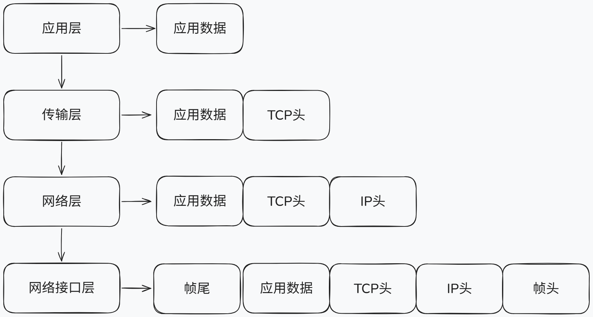
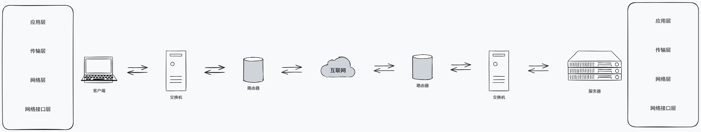

对于前端开发者来说，80%需要关注的内容都集中在 **应用层（HTTP）、传输层（TCP/IP）和性能/安全** 这几个部分，所以我们分为下面几个板块来梳理一下相关的内容。

## 从输入 URL 到页面展示发生了什么？

数据传输是网络的根本目的，所以我们有了通信这一方法，来发送/接收数据。

在相同设备上，进程间通信并非难事，科学家们提供了非常多的方案；对于不同设备上的进程通信，则需要定义一套通用网络协议防止你说洋文我说方言，保证通信规范性。于是科学家们提出了网络模型。

主流的网络模型有三种：
- OSI七层模型，由国际标准化组织ISO提出，也就是“标准”，实际上用得少，但是对于排查故障有一定参考效果
- 五层网络模型，目前教材上讲解的就是这个模型，适合教学，平衡了OSI模型和TCP/IP模型的复杂度
- TCP/IP四层模型，做更进一步的简化。

实际工作中用的更多的是TCP/IP四层模型或者五层网络模型（也说五层网络模型是更现代的TCP/IP四层模型：将四层模型的网络接口层拆分为了数据链路层和物理层，隔离了数字信号和电信号），OSI模型起到的更多是指导作用。

网络模型都是分层的，不同的层次有不同的职能。它们共同保证的数据传输的稳定性。接下来就以**TCP/IP四层模型为例**，自顶向下的梳理一下从在浏览器中输入URL网址到展示出页面的这一过程中，发生了什么。

### 各个层级的作用

接下来简单说明一下各个层级的作用：

- 应用层：我们直接能接触到的就是应用层，它通过一系列协议（http、SMTP、FTP、DNS等等），专注为用户提供功能，本身不关注数据的传输。操作系统层面，它工作在用户态，以下层级都工作在内核态。
- 传输层：传输层为应用层提供网络支持，应用层的数据会下发给传输层，并从中接受需要的数据。它包含两个协议，一个是TCP、一个是UDP：大部分应用使用TCP协议（例如http协议，由TCP保证其内容的可靠传输），它拥有许多特性例如流量控制、超时重传等等——稳定、可靠；而UDP只负责发送数据包而不管包到没到，实时性更好、传输效率更高（如果要实现类TCP的特性，其实可以从应用层上下功夫，但是相对应的开发成本不低）。
- 网络层：传输层通过端口实现应用到应用的传输，而网络层则负责设备到设备的传输。这一层通过IP协议的两个功能：寻址和路由，决定数据要去哪个设备以及怎么去到这个设备——寻址通过IP地址配合子网掩码算出起点和终点；而路由通过路由算法决定要走哪条路线。
- 网络接口层：网络层虽然能够算出起点和终点，但是对于路径中的途径点一概不知。数据在以太网中要到达需要到达的设备，则需要通过MAC地址来标识设备，从而实现数据在以太网上的传输。

下面是每一层的封装格式：

网络分层中的数据传输单位在不同层级有不同的名称：

1. **HTTP层（应用层）**：消息/报文（message）
2. **TCP层（传输层）**：段（segment）
3. **IP层（网络层）**：包（packet）
4. **网络接口层（链路层）**：帧（frame）

这些术语反映了数据在不同层级封装时的形态变化，但本质上都是数据包的某种形式。在实际讨论中，这些名词常被统称为“数据包”。

### 当键入网址后，到网页显示，其间发生了什么

一个相当经典的前端面试题，不过很有价值。接下来以一个简单的网络拓扑模型（客户端说“我要请求这个数据”；服务器说“OK发给你”），来探究一下整个过程：

#### step 1：解析URL

计算机领域中很多表达式都需要翻译或者解析才能被计算机看懂，URL也不例外。所以首先需要做的就是解析用户输入的URL，从而才能生成发送给web服务器的请求信息。小林coding的这张图很好的解释了URL的含义：

从上图可以看出，URL（中文名为统一资源定位器）实际上请求的就是服务器中的特定文件资源——也就是两个信息：请求的是哪个服务器、请求的是这个服务器下的哪个资源（特殊的，当省略了路径名时，请求的是当前服务器下的默认资源，如前端常见的index.html）。

根据这两个信息，就能生成HTTP请求信息了（有关HTTP的具体内容见下一部分）：

#### step2：查询真实地址

在解析URL并生成HTTP请求信息后，下一部分工作则需要浏览器移交到操作系统将消息发送到服务器。但是在此之前，必须将通信对象的IP地址提供给操作系统：

这也就是第二步的目的：根据URL，找到对应的IP地址。

但是茫茫多的域名和IP，如果逐条对比无异于是大海捞针。DNS服务器在这个时候就大显神威了——它起到了一个类似于电话本的作用，专门保存了web服务器和IP地址的对应关系

#### 

## HTTP 协议的演进 (1.0 -> 1.1 -> 2.0 -> 3.0)

## 关于 TCP/IP 你需要知道的事

## 浏览器缓存策略

## 安全/性能相关

> 参考：
> - [小林coding 图解网络](https://xiaolincoding.com/network/)
> - [web.dev 使用 HTTP 缓存防止不必要的网络请求](https://web.dev/articles/http-cache?hl=zh-cn)
> - [MDN 跨源资源共享（CORS）](https://developer.mozilla.org/zh-CN/docs/Web/HTTP/Guides/CORS)
> - [前端安全系列（一）：如何防止XSS攻击？](https://tech.meituan.com/2018/09/27/fe-security.html)
> - [前端安全系列（二）：如何防止CSRF攻击？](https://tech.meituan.com/2018/09/27/fe-security.html)