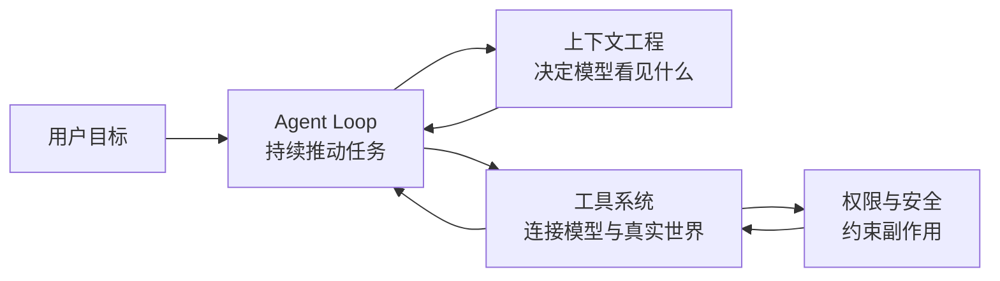
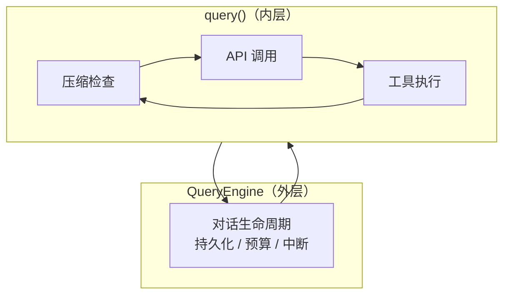
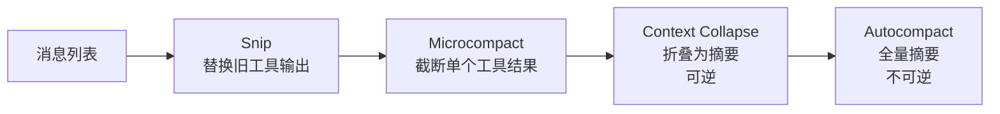
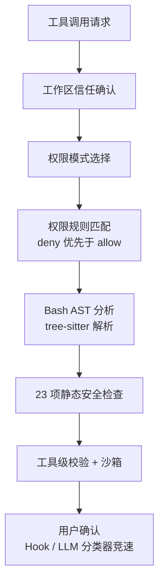
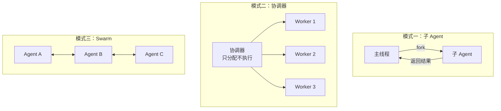
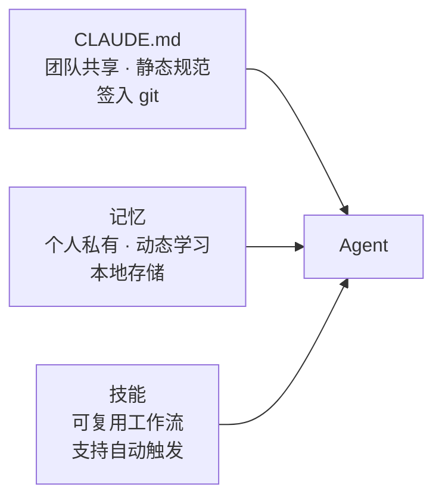

一个有意思的数字：Claude Code 的源码仓库大约有一千九百个 TypeScript 文件、五十一万行代码。如果只是"把用户的话发给大模型，把大模型的回复显示出来"，几百行就够了。那五十万行在做的事情，就是这篇文章尝试回答的问题。

先从一段对话场景开始。

用户说："把这个模块的错误处理统一改成新的 ErrorHandler 模式。"一个普通的聊天助手会回一段文字建议。一个代码补全工具会在光标位置生成一个函数体。而 Claude Code 会先搜索所有引用了旧错误处理模式的文件，逐个读取上下文，逐个做精确替换编辑，每改完几处就跑一次测试，测试挂了就读错误日志、修代码、再跑，直到全绿，然后交一个 commit。

> 从"回一段文字"到"完成一个多步工程任务"，中间差的不是模型能力，而是一整套让模型能在真实环境里持续行动的工程系统。

## 不是功能清单，而是需要回答的问题

如果直接列出 Claude Code 的所有功能模块，会得到一串无意义的清单。更有效的方式是把它的架构看作对四个关键问题的回答：

| 问题 | 对应的子系统 | 核心挑战 |
|------|-------------|---------|
| 任务怎么持续往前推进？ | Agent Loop | 多轮决策、状态维护、错误恢复 |
| 模型每一步看见什么？ | 上下文工程 | 控制体积、保留关键信息、缓存稳定 |
| 系统怎么从生成文本变成改动世界？ | 工具系统 | 统一接口、安全执行、精确编辑 |
| 危险能力如何被约束？ | 权限与安全 | 纵深防御、拒绝优先、人机协同 |

这四个问题串在一起，构成了理解 Claude Code 的主线。它们之间的关系可以画成：



> 循环是引擎，上下文是燃料，工具是手脚，安全是闸门。四者咬合在一起，coding agent 才从"会生成代码的模型"变成"能在本地工程环境里持续完成任务的运行时"。

## 循环是引擎，上下文是燃料

Agent Loop 和上下文管理是最核心的两个子系统，而且它们彼此深度依赖。

从最简形式看，Agent Loop 就是一个持续运行的流程：

```txt
组装上下文 → 调用模型 → 模型决策
  → 有工具调用？执行它，把结果加入上下文，回到开头
  → 没有工具调用？返回文本回复，结束
```

真正让这个循环稳定运行的，是**两层分工**和**错误恢复**。

会话层（`QueryEngine`）关心的是整段对话的生命周期：token 预算还剩多少、用户有没有按 Ctrl+C、历史怎么落盘。执行层（`query`）关心的是单轮：这轮的消息要不要先压缩、API 返回了什么、工具怎么跑、跑完怎么把结果拼回去。两层分开之后，各自不操心对方的事。



这种分层在很多 Agent 框架里都有体现。LangChain 的 AgentExecutor 也是外层管迭代、内层管单步，但它通常用 Promise 链而不是 generator。Claude Code 选择 **async generator** 而不是 Promise 或 EventEmitter，这个选型有三个关键理由：

| 模式 | 流式支持 | 背压控制 | 取消传播 |
|------|---------|---------|---------|
| Callback | 手动实现 | 无天然机制 | 每层手动接线 |
| Promise/async-await | 阻塞式等待，需轮询 | 无 | 无法取消已启动的 Promise |
| **Async Generator** | yield 天然流式 | 消费端按节奏拉取 | `generator.return()` 级联清理 |

错误恢复是循环质量的试金石。Claude Code 的循环有**七个不同的"继续点"**，每个对应一种恢复场景：上下文太长就先压缩再试、输出截断就用更大的 token 限制重试或者注入续写指令。关键是这些恢复对上层透明——可恢复的错误被扣在内部，用户和 SDK 消费者只看到恢复后的干净结果。

流式并行是另一个关键优化。模型生成回复通常要 5~30 秒，Claude Code 不等它生成完——每当解析器在流中检测到一个完整的工具调用 block，就立即开始执行。只读工具甚至可以并行跑。等模型生成完，这些工具的结果已经回来了。

所有这些都跑在同一个上下文中。每次 API 调用，上下文大致分三层：

| 层级 | 内容 | 稳定性 | 缓存策略 |
|------|------|--------|---------|
| 系统提示词 | Agent 身份、行为约束、工具说明 | 最稳定，全球用户共享 | `scope: 'global'` 全局缓存 |
| 环境信息 | git 状态、CLAUDE.md、日期 | 会话级稳定 | 放在消息中，不破坏系统缓存 |
| 消息历史 | 对话记录、工具结果 | 每轮增长 | 分级压缩管理 |

上下文管理的关键不在"记得越多越好"，而在"在有限窗口里保留当前决策真正需要的信息"。Claude Code 的做法是用一条从轻到重的压缩流水线：



四级按成本从低到高排列，能用轻手段就不上重手段。压缩后还要主动恢复当前工作面——重新读取最近编辑过的文件、重新激活仍在生效的流程说明。

## 工具是边界，编辑是精度

没有工具，模型只能生成文本。有了工具，它才能读仓库、改代码、跑测试。工具层做三件事：

**统一接口。**所有能力——读文件、改文件、执行命令、搜索内容、派生子任务、MCP 外部服务——都落在同一个 `Tool` 接口下。关键创新是：接口不仅声明输入 schema，还声明**安全属性**（`isReadOnly()`、`isConcurrencySafe()`、`isDestructive()`）。安全语义编码为接口方法而非外部配置，确保属性与实现始终同步。

**默认保守。**每个工具如果不显式声明只读、并发安全、风险等级，系统就按最高风险处理——这是 fail-closed 设计。

**并发策略。**只读并行、写入串行。写入工具的大部分时间消耗在磁盘 I/O 而非等待，并行收益不大，但冲突风险是真实的。

代码编辑策略是最值得展开的部分。业内四种方案各有取舍：

| 方案 | 代表 | 优势 | 致命缺陷 |
|------|------|------|---------|
| 行号编辑 | 早期 Cursor Chat | 直觉简单 | 多轮编辑后行号必然漂移 |
| AST 编辑 | 理论方案 | 语义级操作 | 需为每种语言维护解析器；语法错误文件无法解析 |
| Unified diff | Git patch | diff 最小表示 | 模型在精确格式上错误率极高 |
| **Search-and-replace** | **Claude Code** | 位置无关、抗幻觉、token 高效 | 大范围重写时较碎 |

Search-and-replace 最被低估的优势是**幻觉安全**：如果模型幻想出一段不存在的旧代码，编辑直接失败并报错——这是一个主动的失败模式而非静默错误。全量重写模式下，幻想的代码会悄无声息地被写进文件。

编辑前必须先读文件是工具层的强制检查——不是提示词建议。

## 安全是层层闸门，不是一道锁

coding agent 最危险的能力恰好也是最有用的：执行 Shell、改文件、操作 git。安全设计的核心思想是纵深防御。



七层防线使用不同的技术，覆盖不同的风险类型。关键设计原则：

- **拒绝优先**：deny 规则在任何权限模式下都生效，不能被宽松模式覆盖
- **Bash 走 AST 而非正则**：`r"m" -rf /`、`$(echo rm) -rf /` 都能绕过字符串匹配，但 AST 解析能识别实际命令
- **竞速决策**：UI 对话框、Hook、LLM 分类器同时跑，最快的结果生效；但人一旦动手，自动化结果立刻丢弃

## 多 Agent 不是高级功能，是物理约束下的分工

单 Agent 在做边界清晰的任务时很顺手。但上下文窗口的容量和执行者的处理速度都有物理上限。多 Agent 是在这些约束下的工程选择。



Claude Code 的选择很保守：子 Agent 不继承父对话历史、禁止元工具（防无限嵌套）、tool set 是父的子集、写入走 worktree 隔离。保守不是能力不够，而是对多 Agent 系统故障模式的敬畏。

## 记忆和技能：跨会话的能力沉淀

这是两个互补的系统。

**记忆**遵循一条核心约束：只记不能从当前代码、git 历史和已有文档直接推导的信息。值得记的是用户偏好、行为反馈、项目决策和外部资源指针。用封闭的四类分类法防止标签膨胀：

| 类型 | 记什么 | 示例 |
|------|--------|------|
| `user` | 用户身份、偏好、知识背景 | "用户是数据科学家，专注可观测性" |
| `feedback` | 行为纠正和认可 | "不要用 npm，用 pnpm" |
| `project` | 项目进展、决策、截止日期 | "2026-03-05 后合并冻结" |
| `reference` | 外部系统定位 | "性能追踪在 Linear BOARD-123" |

**技能**把经过验证的提示词固化为可复用能力。双重调用路径（用户手动 + 模型自动匹配）让技能从斜杠命令扩展到 Agent 的自然行为。懒加载保证不触发就不占上下文。

CLAUDE.md、记忆、技能三者分工明确：



## 最小骨架与生产级之间的鸿沟

如果只保留核心，可运行的 coding agent 只需要七块：上下文组装、工具注册、主循环、文件读写、命令执行、编辑策略、交互界面。演示级可以控制在几千行。

Claude Code 的体量主要在补齐工程细节：权限的每一层、压缩的每一级、Hook 的每种类型、子 Agent 的每种隔离模式、token 预算的跨压缩结转、缓存断裂的自动检测与归因、会话持久化与恢复。每一块的实现规模都不大，但块数多、块之间的交互复杂，整体体量必然膨胀。

## 四条线串起全局

回到一开始的四个问题，Claude Code 的整个架构可以沿四条线来理解：

- **循环线**。双层分离、七个继续点、错误扣留、流式并行 → [第 002 篇：Agent Loop](/blog/2026/agentGo/006)
- **上下文线**。三层结构、五级压缩、缓存感知、压缩恢复 → [第 003 篇：上下文工程](/blog/2026/agentGo/007)
- **工具线**。统一接口、fail-closed、精确替换 → [第 004 篇：工具系统与代码编辑](/blog/2026/agentGo/008)
- **安全线**。纵深防御、拒绝优先、AST 分析 → [第 005 篇：权限与安全](/blog/2026/agentGo/009)

后续文章会沿着这四条线逐条下钻。
