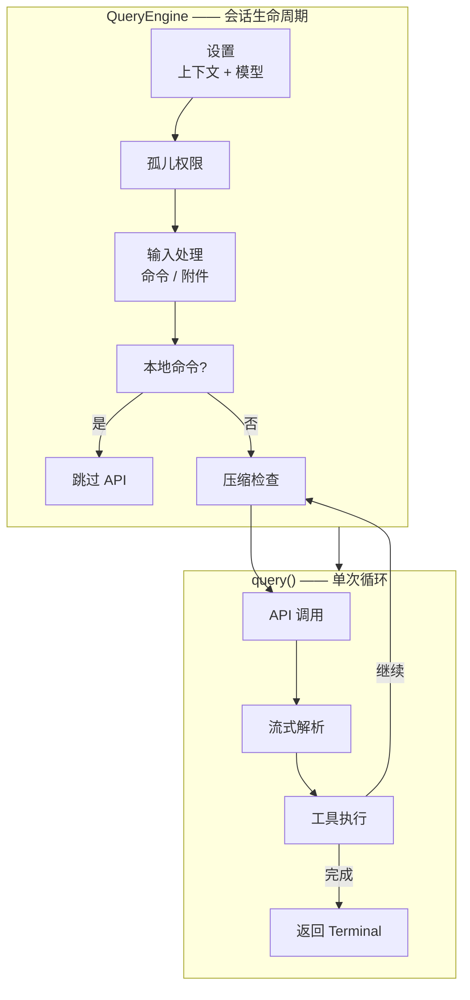
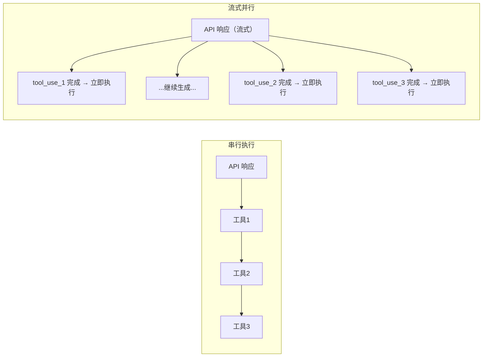
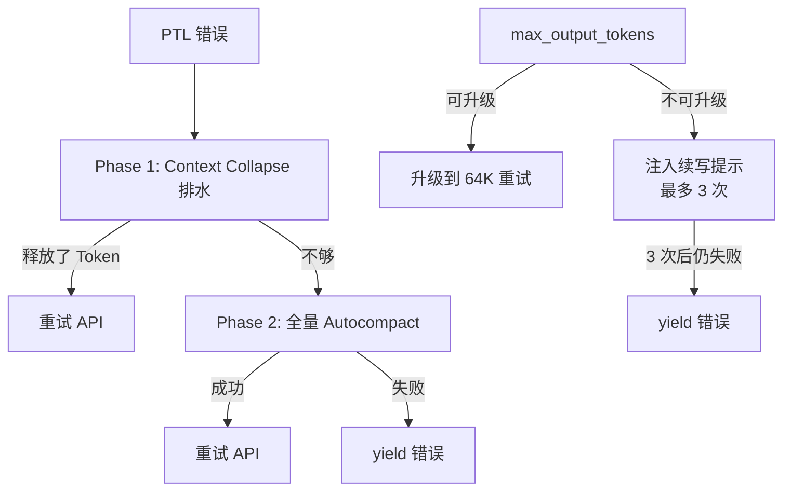

上一篇文章建立了一个全局框架：四条线串起 Claude Code 的架构——循环、上下文、工具、安全。这篇文章专拆循环。

如果你只记住一件事，记住这个：Agent Loop 不是"调 API 再执行工具"那么简单。它要面对流式输出的实时渲染、多轮工具调用的并发调度、各种意外情况（输出截断、上下文过长、API 不可用）的自动恢复，以及在这些复杂性之上还要保持代码可读、可测试、不因为加了恢复逻辑就变成面条。所有这些约束叠加在一起，才有了它现在的生成器架构和七继续点设计。

## Agent Loop 的起点：不是什么，是什么

先划清边界。

**Agent Loop 不是 workflow 引擎。**Workflow 引擎（Dify、Coze、n8n）用一个预定义的节点图来控制执行路径——步骤 A 之后走步骤 B，条件分支走步骤 C 还是 D，都由人预先连好。Agent Loop 里面，下一步做什么是模型在执行过程中动态决定的。

**Agent Loop 也不是简单的 retry 逻辑。**retry 只覆盖"API 调用失败"这一种异常。真实的编码任务中，异常场景远比这多：上下文过长、输出被截断、工具执行失败但模型可以换种方式重试、压缩本身也可能失败。每种异常需要不同的恢复策略，而且恢复的结果很可能是"继续循环"而不是"向上抛错误"。

## 生成器：为什么不是 Callback，不是 Promise

Claude Code 的主循环签名是：

```typescript
async function* query(
  params: QueryParams,
): AsyncGenerator<StreamEvent | Message | ToolUseSummaryMessage, Terminal>
```

一个 async generator。边执行边 yield 事件，不必等全部完成再返回。这个选型不是审美偏好，是对三种异步模式的工程取舍。

| 模式 | 流式支持 | 背压控制 | 取消传播 | 典型使用 |
|------|---------|---------|---------|---------|
| Callback | 手动实现，每层 callback 转发 | 无天然机制，需手动缓冲区 | 每层手动接线取消逻辑 | 经典 Node.js |
| Promise/async-await | `await` 阻塞式等待 | 无 | 无法取消已启动的 Promise | LangChain AgentExecutor |
| **Async Generator** | `yield` 天然流式 | 消费端 `for await` 按节奏拉取 | `generator.return()` 级联清理 | **Claude Code** |

**Callback** 最大的问题不是 callback hell（那个可以用 Promise 解决），而是背压。当模型产出的速度快于 UI 渲染速度时，callback 没有自然的暂停机制。取消更麻烦——用户按 Ctrl+C 后，需要在每一层 callback 中手动接线取消逻辑，稍有不慎就内存泄漏。

**Promise / async-await** 解决了 callback hell。但 `await apiCall()` 是阻塞式等待——必须等整个响应完成才能返回。一旦启动就无法取消——你可以在上层忽略结果，但底层的 API 请求还在跑。

**Generator** 的 `yield` 和 `return` 分别对应流式事件和最终结果，天生就是为此设计的。更关键的是，`generator.return()` 可以级联清理整个调用链：

```mermaid
graph LR
    User[用户按 Ctrl+C] --> REPL[REPL 层]
    REPL -->|generator.return| QE[QueryEngine]
    QE -->|generator.return| Query[query()]
    Query -->|abort| API[API 请求]
```

不需要手动在每一层接线——清理信号沿 generator 链自动传播。

## 双层分离：会话生命与单次执行

Agent Loop 拆成了两层。就像操作系统把进程调度和单次 CPU 时间片执行拆开一样。



**QueryEngine**（外层）管理整段对话的生命周期。它的 `submitMessage()` 驱动一次完整的用户交互，包含八个阶段。**query()**（内层）管理单次循环迭代——压缩、调 API、解析流、执行工具、拼回结果。

为什么要分开？因为调用方不同：

| 入口模式 | 路径 | 用途 |
|---------|------|------|
| REPL 交互式 | 用户输入 → 直接进入 `query()` | 终端日常使用 |
| Print 模式（`-p`） | 先经 `QueryEngine` → 再进 `query()` | 脚本 / CI 单次调用 |
| SDK 模式 | 先经 `QueryEngine` → 再进 `query()` | IDE 集成 / 第三方调用 |

三条截然不同的入口路径，最终汇聚到同一套核心循环。没有这一层分离，Print 和 SDK 模式就需要各自实现一套会话管理逻辑。

## 状态管理：不可变参数与可变状态

`query()` 内部有一个重要的区分：

```typescript
async function* queryLoop(params: QueryParams) {
  // 不可变参数 — 循环期间永不重新赋值
  const { systemPrompt, userContext, canUseTool, maxTurns } = params

  // 可变跨迭代状态 — 通过整体赋值更新
  let state: State = {
    messages: params.messages,
    turnCount: 0,
    transition: undefined,
  }
  // 在每个 continue site:
  // state = { ...state, messages: newMessages, turnCount: state.turnCount + 1 }
}
```

选择不可变更新（`state = { ...state }`）而非直接修改字段，有两个原因：状态变更更加明确和可追踪（每次赋值都是一个清晰的变更点）；引用变化能被 React 渲染层捕获——generator yield 出去的事件直接触发 UI 更新。

## 流式并行：把工具延迟藏进模型生成时间

这是循环内部一个重要的性能优化。在朴素的实现中，流程是串行的：

```txt
[===== API 响应 5-30s =====][tool1][tool2][tool3]
总时长 = API 时间 + 工具1 + 工具2 + 工具3
```

Claude Code 利用了两个事实来打破串行瓶颈：模型生成是逐 token 流出的，工具调用 block 在流中完成解析的时刻远早于整个响应完成。于是 StreamingToolExecutor 不等整个响应结束就开始执行：



| 执行模式 | 总时长 | 工具延迟感知 |
|---------|--------|------------|
| 串行 | API 时间 + Σ 工具时间 | 用户等待 |  
| 流式并行 | max(API 时间, Σ 工具时间) | 几乎无感 |

**并发安全分类**是调度器的核心规则。只读操作（Grep、Glob、Read）之间天然安全——它们不修改任何状态。写入操作（Edit、Write）之间以及写入和读取之间可能冲突。Bash 有特殊规则：当一个 Bash 命令出错时，并行执行中的兄弟 Bash 被取消——因为 Bash 命令之间常有隐式依赖。

## 七个继续点：故障的精细化处理

这是 `query()` 循环里最体现工程质量的部分。循环不只是因为"模型又调了工具"才继续——有七个不同的原因能让循环继续：

| 继续原因 | 触发条件 | 处理方式 | 成本 |
|---------|---------|---------|------|
| `next_turn` | 模型调用了工具 | 执行工具，注入结果，继续循环 | 常态 |
| `collapse_drain_retry` | PTL 错误 + Collapse 有暂存 | 提交折叠，释放 Token，重试 | 零 API |
| `reactive_compact_retry` | PTL 错误 + Collapse 不够 | 强制全量 Autocompact | 一次 API |
| `max_output_tokens_escalate` | 输出 Token 被截断 | 升级到 64K，不注入新消息重试 | 零 API |
| `max_output_tokens_recovery` | 升级不可用 / 已用 | 注入续写提示，最多 3 次 | 零 API |
| `stop_hook_blocking` | Stop Hook 阻止停止 | 继续循环 | 零 API |
| `token_budget_continuation` | SDK 模式预算耗尽 | 注入续写指令 | 零 API |



关键不是有七个继续点，而是每种故障有**对应的恢复策略**——不是所有错误都走同一套重试路径。

## 错误扣留：为什么不让上层看见错误

当出现 prompt_too_long 或 max_output_tokens 错误时，`query()` 不会立即通知调用方。它将错误包装成一条 AssistantMessage（带 `apiError` 标记），推入消息列表但不 yield 出去。然后执行恢复逻辑。如果恢复成功，错误永远不暴露。

**为什么这么设计？** 如果不扣留，SDK 消费者收到 error 类型消息后会终止会话——但后端的恢复循环还在运行，前端已经不再监听了。扣留机制保证上层只看到"干净"的结果流。

这和操作系统的错误处理哲学类似：内核有问题的内存页先尝试交换和重新分配，用户进程不应该感知到这次 page fault。只有在所有恢复手段都耗尽时，才给进程发 SIGSEGV。

## 停止条件

循环正常停止的条件是模型不再调用工具——响应中不包含 tool_use block。这是模型自己的判断。

但还有四道保护性停止条件：

| 条件 | 触发 | 设计理由 |
|------|------|---------|
| 最大轮次 | `maxTurns` 限制 | 防止无限循环 |
| 成本上限 | 累计 USD 成本超过预算 | 防止意外消费 |
| 用户中断 | Ctrl+C | 用户永远有最终控制权 |
| 不可恢复错误 | PTL/MOT 恢复全部失败 | 确认修不好了才终止 |

**连续压缩失败的熔断器**是一个有趣的案例。生产数据显示：加熔断器前，单次会话中连续压缩失败超过 50 次的有 1279 个。每次失败都是白费一次 API 调用。熔断器在连续 3 次失败后停止所有后续压缩尝试，让循环靠其他恢复路径处理剩余问题。

## 与其他 Agent 循环的对比

| 系统 | 循环模式 | 错误恢复 | 流式 | 适用场景 |
|------|---------|---------|------|---------|
| LangChain AgentExecutor | async/await + callback | 统一 try-catch + retry | 非流式优先 | Notebook / Batch |
| AutoGPT 早期 | 无限制 spawn 子任务 | 几乎没有 | 无流式 | 实验 demo |
| Aider | 单步 → 用户 review → 反馈 | 用户手动 | 流式 diff | 交互式编码 |
| **Claude Code** | async generator + 双层 | 7 种继续点 + 错误扣留 | 流式 + 并行执行 | 生产级 coding agent |

Aider 的"人类在环"设计天然限制了循环复杂度——不会有十几轮工具调用暗中狂跑。代价是用户必须持续关注。Claude Code 选择了一条中间路线：允许自主跑多轮，但每一轮都在清晰的约束和恢复机制下运行。

## 小结

Agent Loop 的设计可以做三层理解：

**结构层**。双层生成器分离了会话生命周期和单次执行。不同入口汇聚到同一个核心循环。状态以不可变更新的方式维护。

**执行层**。流式并行把工具延迟藏进模型生成窗口。七个继续点对故障做精细化处理。编译时 feature gate 让敏感功能物理上不存在于外部构建。

**策略层**。错误扣留让可恢复错误对上层透明。停止条件设置多层保护，防止边界情况导致无限循环或巨额消费。
