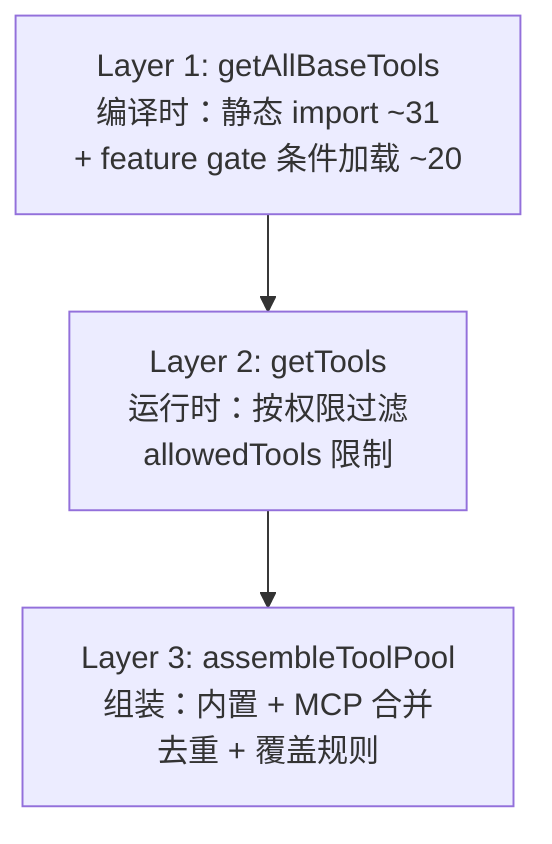
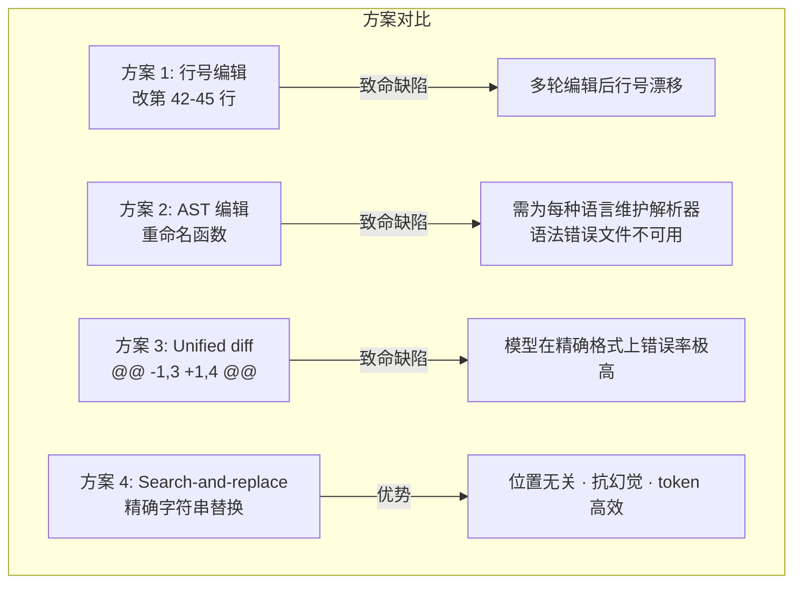

前面两篇拆了循环和上下文。循环负责推进任务，上下文负责提供信息。这些最终都是为了一个目的——让模型能够在真实仓库里行动。

从"生成文本"到"执行动作"，中间隔着一整套工具系统。这篇文章拆工具层：它的接口设计、安全哲学、并发策略，以及 coding agent 最核心也最危险的能力——代码编辑。

## 统一接口：让不同来源的能力走同一套管道

Claude Code 有约 55 个工具。读文件、写文件、执行命令、搜索内容、派生子任务、通过 MCP 接入的外部服务——来源不同，但都放在同一个 `Tool` 接口下。

```mermaid
graph LR
    subgraph 工具来源
        Builtin[内置工具<br/>Read / Edit / Bash / Grep]
        MCP_Tools[MCP 外部工具<br/>Kubernetes / 数据库]
        Plugin[插件工具]
    end
    subgraph 统一执行管道
        Validate[输入校验<br/>Zod Schema]
        Permission[权限检查<br/>isReadOnly / isDestructive]
        Execute[执行<br/>call()]
        Format[结果格式化<br/>renderToolResult]
    end
    Builtin --> Validate
    MCP_Tools --> Validate
    Plugin --> Validate
    Validate --> Permission --> Execute --> Format
```

`Tool` 接口定义约 **20 个字段和方法**，每个都在执行管道中承担特定角色：

| 字段 / 方法 | 角色 | 默认值 |
|------------|------|--------|
| `inputSchema`（Zod） | 参数验证，自动转 JSON Schema 发给 API | 必填 |
| `isReadOnly()` | 告诉权限系统是否可跳过人工确认 | `false` |
| `isConcurrencySafe()` | 告诉调度器能否并行执行 | `false` |
| `isDestructive()` | 标记破坏性操作 | `false` |
| `shouldDefer` | 是否延迟发送完整 schema（按需加载） | — |
| `checkPermissions(input, context)` | 工具特有的权限检查 | 默认允许 |
| `validateInput(input, context)` | 执行前最后一道校验 | — |
| `call(args, context)` | 实际执行逻辑 | 必填 |

> **核心设计理念**：把安全语义编码为接口方法，而非外部配置。`isReadOnly` 是代码里的一段逻辑，不是一个 JSON 文件里的字符串。工具行为变更必须伴随安全声明的同步更新——因为声明和实现在同一个文件里。

### 与 OpenAI function calling、LangChain BaseTool 的对比

| 维度 | OpenAI function calling | LangChain BaseTool | Claude Code Tool |
|------|------------------------|-------------------|-----------------|
| 参数验证 | JSON Schema（仅声明） | 可选 | Zod Schema（声明 + 运行时验证） |
| 安全语义 | 无 | 无标准字段 | `isReadOnly` / `isDestructive` / `isConcurrencySafe` |
| 默认安全策略 | 无 | 无 | **fail-closed**：不声明=不安全 |
| 并发控制 | 无 | 无 | 声明式 + 调度器强制执行 |

## 工具组装的三层流水线



- **编译时**：feature gate 为 false 的工具在构建产物中物理不存在
- **运行时**：用户配置的 `allowedTools` 过滤掉未授权工具
- **组装时**：内置工具和 MCP 工具合并为统一池，处理同名覆盖

## 并发策略：只读并行、写入串行

三种可能的并发策略：

| 策略 | 正确性 | 性能 | 实现复杂度 |
|------|--------|------|-----------|
| 全串行 | 绝对正确 | 最差 | 最简 |
| 依赖分析（判断编辑区域是否重叠） | 理论最优 | 最优 | 复杂，可能出错 |
| **声明分类**（只读并行、写入串行） | 安全 | 接近最优 | 中等 |

Claude Code 选的是第三种。只读工具并行是结构性的安全——不修改状态就不存在冲突。写入工具串行是因为写入的大部分时间消耗在磁盘 I/O 而非等待，并行收益不大，但冲突风险真实。

## 代码编辑：四种方案与选择



**幻觉安全**是 search-and-replace 最被低估的优势。如果模型"记得"文件中有 `handleError()`，但实际上已被重命名为 `processError()`：

| 编辑模式 | 模型提供 `old_string: "handleError()"` 的结果 |
|---------|---------------------------------------------|
| Search-and-replace | 编辑失败 + 报错："String not found" → 模型重新读文件 → 发现正确函数名 |
| 全文件重写 | 含 `handleError()` 的完整文件被**静默写回** → 覆盖正确的 `processError()` → 零报错 |

> **可靠的失败比不可靠的成功更重要。** 失败的编辑能被模型感知和修复，但静默的错误会逐渐侵蚀代码质量而无人察觉。

### 编辑的校验管道

一次编辑经过的步骤远比"查找-替换"复杂：

| 阶段 | 检查 | 失败后果 |
|------|------|---------|
| 预处理 | 尾随空白裁剪（.md/.mdx 例外） | — |
| 读取检查 | `hasReadFileInSession` 标志位 | 拒绝：未读即编 |
| 唯一性检查 | `old_string` 在文件中唯一 | 列出所有匹配位置，要求更多上下文 |
| 替换执行 | 精确替换 | — |
| 结果验证 | Diff 生成与显示 | — |

> "先读后写"不是提示词建议，而是**工具层的强制检查**。从期望变成强制，可靠性差距很大。

## 工具设计的两个哲学原则

**统一接口 = 横切关注点的共同落点。**权限、日志、错误处理、并发控制——所有这些横切逻辑都因为统一接口而有了唯一实现位置。这和 Unix 的"一切皆文件"哲学类似。

**Fail-closed = 疏忽偏向安全。**`isReadOnly` 默认 false、`isConcurrencySafe` 默认 false、`isDestructive` 默认 false。漏声明导致功能受限（需要人工确认、不能并行），而非安全漏洞。这和网络安全中的默认拒绝原则一致。

## 小结

工具系统的设计有三个核心判断：

**统一**。不因来源不同给不同执行路径。所有工具走同一套管道——声明、校验、权限、执行、格式化。

**保守**。默认值全偏向安全。漏声明最多让性能差一点，不会让危险操作被默许。

**精确**。代码编辑走 search-and-replace。每次改动都是可验证的 from-to。改不成就报错，不是静默写错。
