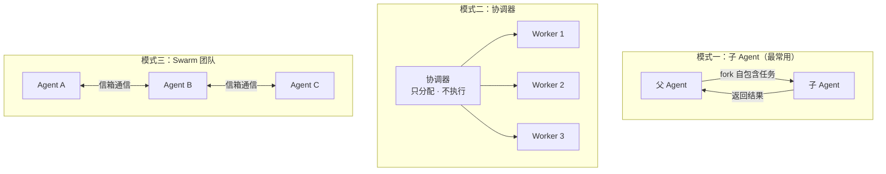
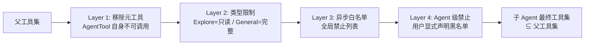
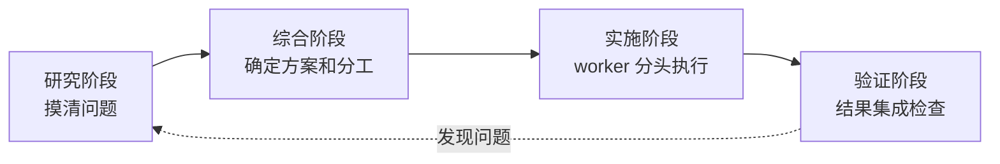

前六篇讨论的都是单个 Agent——在单上下文窗口内、单执行者推进任务。这个限制在大多数日常任务中是透明的。但"重构整个 API 层并更新所有调用方"这种任务天然超出单 Agent 的物理上限。

多 Agent 回答的问题很具体：**当单个上下文窗口和单个执行者不够用时，系统怎么继续推进？**

## 三种模式总览

| 模式 | 通信方式 | 中心 | 适用场景 |
|------|---------|------|---------|
| 子 Agent | fork → 执行 → return | 父 Agent | 独立子任务 |
| 协调器 | 派生 + 收束 | 协调器 | 多阶段复杂任务 |
| Swarm | 对等信箱 | 无中心 | 长期并行、偶尔通信 |

## 子 Agent：自包含与隔离

子 Agent 的**关键设计是不继承父对话历史**。它从零开始，只拿自包含的任务描述。不是因为共享上下文技术做不到，而是因为共享带来的噪音往往大于收益——父对话中无关的联想、十几轮前的工具输出、和当前子任务无关的文件内容，只会分散注意力。

子 Agent 有类型区分：

| 类型 | 工具集 | 模型 | 用途 |
|------|--------|------|------|
| Explore | 只读（Read/Grep/Glob/WebFetch） | Haiku（更便宜） | 搜索、调查 |
| Plan | 只读 + 结构化 JSON 输出 | 标准 | 方案规划 |
| General-purpose | 完整工具集（除元工具） | 标准 | 读写文件 |

> **限制工具就是在限制失败的影响面。**一个搜索型子 Agent 不需要写文件权限，所以不应该拥有。

### 工具过滤的四层管道

每层过滤都是收窄的——**子 Agent 的工具集永远小于等于父 Agent**。不会出现子 Agent 获得父 Agent 都没有的能力。

### 为什么 worktree 隔离比看起来重要

没有 worktree：主线程在 FILE_A 的第 100 行附近做编辑，同时子 Agent 在 FILE_A 的第 50 行插入代码 → 主线程基于 stale 文件内容发出编辑 → 子 Agent 的插入被覆盖。

有 worktree：子 Agent 在自己的独立工作目录操作，修改不影响主工作目录。完成后返回**结构化结果**，由主线程在自己的工作区中手动应用。主线程始终保持对自己的工作区的完全控制。

## 协调器：指挥官不下厨房

子 Agent 模式里，父 Agent 既能分配也能干活——**两个角色混在一起，容易两边不讨好**。协调器模式把两个角色强制分开：协调器只能分配和收束，不准读文件、写代码。

> 限制"不准下厨房"的原因是：防止协调器在 worker 返回结果前基于过时信息做判断。

四个阶段之间，协调器根据上一阶段的输出调整下一阶段的分配。关键：协调器**不会在阶段进行中自己跳进去干活**。

## Swarm：当中心协调器本身成为瓶颈

子 Agent 和协调器都有中心。Swarm 更进一步：多个命名 Agent 通过对等信箱通信，不依赖中央调度。

适合多个 Agent 长期并行关注不同侧面的场景。代价是调度和一致性更难管理——谁什么时候和谁通信、信息怎么同步、冲突怎么处理，需要更细致的协议。

## 多 Agent 的故障模式和保守设计

多 Agent 的故障模式和单 Agent 有本质不同：

| 故障模式 | 原因 | Claude Code 的对策 |
|---------|------|-------------------|
| 子 Agent 永远不返回 | 无限循环 | 轮次上限 + 成本预算 |
| 结果不一致 | 并行子 Agent 各自编辑同一文件 | worktree 隔离 |
| 任务树爆炸 | 子 Agent 无限嵌套 | 禁止元工具（AgentTool） |
| 基于过时信息决策 | 协调器在 worker 返回前读文件 | 协调器不准读不准写 |
| 通信混乱 | Swarm Agent 消息未被及时处理 | 不承诺实时送达 |

> **多 Agent 系统的设计必须比单 Agent 更保守。**不继承对话历史是保守，禁止元工具是保守，tool set 是父的子集是保守，worktree 隔离是保守。不是因为能力不够，而是因为对复杂系统故障模式的敬畏。

## 与其他多 Agent 框架的对比

| 框架 | 任务分解 | 通信方式 | 控制力度 |
|------|---------|---------|---------|
| AutoGPT 早期 | Agent 自行 spawn（常失控） | 任务列表 | 几乎无限制 |
| CrewAI | 开发者显式定义角色和任务 | 顺序 / 层级 | 设计时固定 |
| AutoGen | 开发者定义 Agent 和对话模式 | 对话驱动 | 设计时灵活 |
| **Claude Code** | 运行时动态 fork + 多层约束 | fork-return / 信箱 | 每层收窄 |

Claude Code 的路线是"运行时动态 fork，但 fork 时用多层约束控制爆炸面"。开发者不需要显式定义每个 Agent 的角色——模型根据任务自行判断——但 fork 出来的 Agent 被严格的约束管道限制住。

## 小结

多 Agent 架构有三个递进的层次和四条安全约束：

- **子 Agent**：自包含任务、不继承历史、工具集收窄、worktree 隔离
- **协调器**：不碰文件不执行、四阶段推进、基于阶段结果调整分配
- **Swarm**：对等信箱、无中心、灵活但管理复杂

四条安全约束：不继承历史（隔离噪音）→ 不传元工具（防嵌套）→ 不授超权（子集原则）→ 不写主空间（worktree 隔离写入）

始终贯穿的判断：**多 Agent 不是高级功能——是物理约束下的工程选择。**能不拆就不拆，该拆时知道怎么安全地拆。
