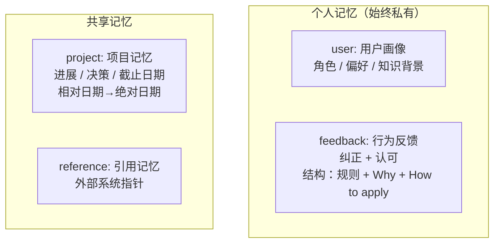
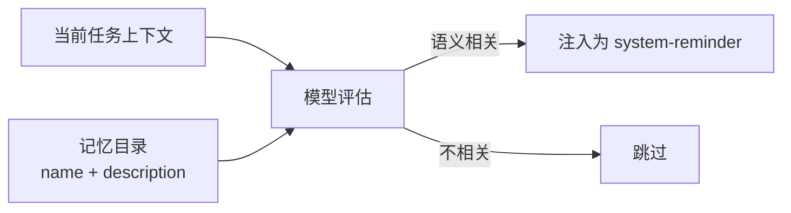
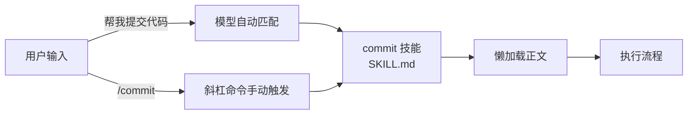
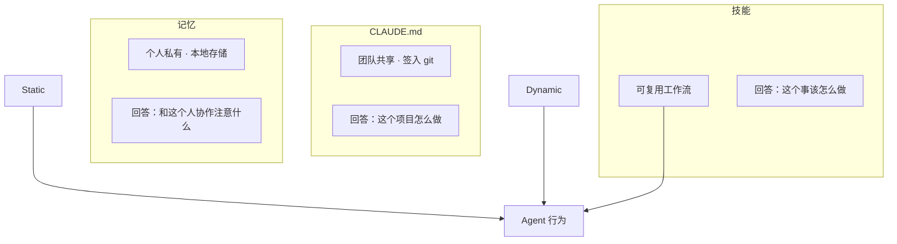

前面七篇文章讨论的都是单次会话内的机制——循环怎么跑、上下文怎么管、工具怎么调、安全怎么防。但有一个问题所有这些都没解决：每次新开会话，Agent 从零开始。

你连续三天和 Claude Code 在同一个项目上协作。第一天你告诉它"不要在这个项目里用 npm，我们要用 pnpm"；第二天你又说了一遍；第三天你开始怀疑自己是在和 Agent 合作还是在训练它。

> 这就是跨会话知识的缺失——每一次都是初见。CLAUDE.md 能解决团队共享的静态规则，但它不是动态的、个人的、随使用积累的。记忆和技能填补了这个空缺。

## 记忆的核心约束：只记推导不出来的

记忆系统的设计起点是一个约束：

> **只记不能从当前项目状态推导出来的信息。**

代码模式、架构、文件路径、git 历史——从代码本身读取永远比从记忆回忆更准确，而且会随着代码演进更新。如果记忆存了"认证模块在 `src/auth/`"，一次代码重构就会让这条记忆从提示变成误导。

这个约束不是省存储空间——是**防止记忆与现实漂移**。代码是真理源，记忆是辅助线索。当两者冲突时，代码赢。

### 四种记忆类型：封闭分类法



| 类型 | 记什么 | 示例 | 触发时机 |
|------|--------|------|---------|
| `user` | 用户身份、偏好、知识背景 | "用户是数据科学家，专注可观测性" | 了解到用户角色/偏好时 |
| `feedback` | 行为纠正 + 认可 | "不要用 npm，用 pnpm" | 用户纠正或肯定行为时 |
| `project` | 项目进展、决策、截止日期 | "2026-03-05 后合并冻结" | 了解到决策/时间线时 |
| `reference` | 外部系统定位 | "性能追踪在 Linear BOARD-123" | 了解到外部信息位置时 |

> 封闭分类法防止标签膨胀导致召回失效——如果允许自由标签，几百条记忆后生态会变得像个人邮箱文件夹一样混乱。

### feedback 的特殊性：不只记失败

feedback 同时记录纠正和认可。源码注释中的原话："如果你只保存纠正，你会避免过去的错误，但会偏离用户已经验证过的好方法，并可能变得过于谨慎。"

feedback 和 project 类型有**结构化要求**：

```markdown
规则本身。

**Why:** 用户给出这个反馈的原因。
**How to apply:** 什么时候 / 在哪里应用这条指导。
```

> 只记规则不记原因，模型在边界情况下无法判断该遵守还是该灵活处理。

### 排除列表：不记什么

| 排除类别 | 原因 |
|---------|------|
| 代码模式、架构、文件路径 | 读当前代码即可，会过期 |
| Git 历史、最近的改动 | git log 是权威来源 |
| CLAUDE.md 已有内容 | 避免重复和冲突 |
| 临时任务细节、当前对话上下文 | 新鲜度衰减太快 |

> 排除规则即使用户明确要求保存也照样生效。记忆的定位不是"对话的存档"，而是"对不可推导判断的索引"。

## 召回：语义而非关键词



与 RAG 向量检索的对比：

| 维度 | RAG 向量检索 | Claude Code 记忆召回 |
|------|------------|-------------------|
| 规模 | 海量文档 | 几十到几百条 |
| 相关性判断 | embedding 余弦相似度 | 模型自身语义评估 |
| 优势场景 | "这段文档讲了什么" | "这条约束是否适用于当前任务" |
| 漏召回风险 | 文本不相似但语义相关 → 漏 | 由模型直接判断，漏召回率更低 |

> "这个项目用 pnpm 而不是 npm"和"添加一个新依赖"在向量空间里可能不接近，但对 Agent 的行为来说是最关键的约束。向量检索在这种场景下容易漏，模型直接评估不会。

## 技能：双重调用与懒加载

技能解决的是重复 AI 工作流的固化。把经过验证的提示词封装为 Markdown 文件：



**双重调用路径**是技能和传统 slash command 的关键区别：

| 调用方式 | 触发者 | 发现成本 |
|---------|--------|---------|
| 手动（`/commit`） | 用户 | 用户需要知道命令存在 |
| **自动（模型匹配）** | 模型 | 零——系统根据意图匹配 |

**懒加载**：技能注册时只加载 frontmatter（name、description、whenToUse），完整提示词正文在调用时才读取。让 20 个技能的存在不额外消耗上下文预算。

**三级 token 预算控制**：全量描述 → 分区描述（内置完整，其余精简）→ 仅名称。保证技能列表自己不会撑爆上下文。

### 技能优先级与团队协作

```txt
托管（企业级） > 项目（团队共享） > 用户（个人） > 插件（市场） > 内置 > MCP
```

**企业可以在托管级别定义标准技能作为行为底线**——个人不能用本地技能覆盖它。项目和个人级别在底线之上做自定义，但不能突破底线。

## 记忆、技能、CLAUDE.md 三者的完整分工



| | CLAUDE.md | 记忆 | 技能 |
|------|-----------|------|------|
| **性质** | 静态规范 | 动态学习 | 可复用能力 |
| **范围** | 团队共享 | 个人私有 | 团队 / 个人 |
| **存储** | 仓库内（git） | 本地 `~/.claude/projects/` | `.claude/skills/` 目录 |
| **更新方式** | 手动编辑 + PR | Agent 自动写入 | 手动创建 + 自动发现建议 |
| **权威来源** | 团队共识 | 个人经验 | 已验证的实践 |

> 缺了任何一块，Agent 都需要在其他块中补足——在 CLAUDE.md 中写个人偏好，在技能提示词中嵌入项目约定，或者反过来。三块齐全，各管一头，互不覆盖。

## 与其他系统的深入对比

**vs LangChain Memory。**LangChain 的记忆偏向"会话内"——帮助 Agent 记住同一对话中之前说过的内容。Claude Code 的上下文压缩流水线覆盖了这个需求。Claude Code 的记忆是"跨会话"的——从多次对话中提炼可复用判断，而非存单次对话内容。

**vs RAG。**RAG 解决"在文档库中找相关片段"，索引目标是内容相关性。记忆解决"从个人经验中召回相关判断"，索引目标是判断相关性。前者的召回可以用向量近似，后者的召回需要模型自己的判断。

**vs Obsidian 个人知识库。**Claude Code 的记忆和 Obsidian 的原子笔记有相似之处——每条记忆是独立 Markdown 文件，带 YAML frontmatter，文件间通过 `[[]]` 链接。但主要读者是模型而非人。文件结构和 frontmatter 为模型的召回效率设计，而非人的阅读体验。

## 小结

记忆和技能共同构成跨会话能力的两个维度。

记忆的核心是"少记，但记有用的"：封闭分类法防止标签膨胀、语义召回保证相关性、排除列表防止记忆成为代码的过时副本、feedback 同时记录纠正和认可让行为在两个方向上收敛。

技能的核心是"双重调用 + 懒加载"：自动触发让发现成本为零、懒加载让存在成本为零、三级 token 预算防止技能列表撑爆上下文、优先级链条保证企业行为底线不被突破。
