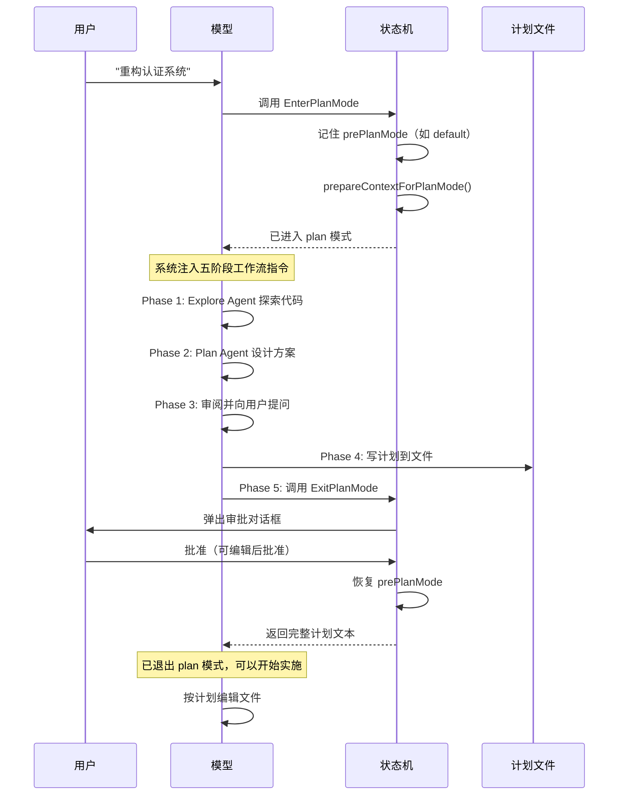

前面八篇拆了 Claude Code 的核心架构——循环、上下文、工具、安全、Hooks、多 Agent、记忆与技能。这些子系统让 Agent 能自主执行。但自主性越高，一个问题的权重就越大：Agent 在执行过程中如何被控制。

这篇文章拆两个相关但独立的控制机制：Plan 模式解决"先想清楚再动手"，任务系统解决"复杂工作拆开追踪"。

## Plan 模式：主动降低权限换取信任

考虑一个场景：你让 Claude Code "重构整个认证系统"。如果它二话不说开始改文件——改了十几个文件、删了几个函数、引入了你完全不想要的库——你只能 `git checkout .` 然后重来。

Plan 模式的设计理念是：对于复杂任务，让模型先探索、再规划、用户审批后才动手。它通过**权限降级**强制模型进入"只读探索加输出计划"的工作模式。



整个流程的关键在于**状态转换的对称性**：进入时记住原模式（`prePlanMode`），退出时精确恢复。这保证了 Plan 模式是一个可嵌套的插入层——无论你原来是 default、auto 还是 bypassPermissions 模式，Plan 模式结束后都能无缝回到之前的状态。

### 两条进入路径

进入 Plan 模式有两条路径，汇聚到同一个状态转换函数。

用户主动触发：在 REPL 中输入 `/plan` 或 `/plan 重构认证系统`。如果带了描述，同时作为用户消息提交，模型在 plan 模式下收到后就开始探索。

模型主动触发：模型判断当前任务复杂度较高时，主动调用 `EnterPlanMode` 工具。这是更常见的路径——模型自己判断"这个任务太大，需要先规划"。关键约束：**子 Agent 不能进入 Plan 模式**。Plan 是用户级别的决策，不容许子 Agent 擅自降级自己的权限。

### 五阶段工作流

进入 Plan 模式后，系统向模型注入一份详细的五阶段工作流指令。第一阶段启动 Explore Agent 做只读代码探索，摸清现状。第二阶段启动 Plan Agent 设计实施方案。第三阶段审阅方案并主动向用户提问澄清不确定的地方。第四阶段把计划写成 Markdown 文件，存到 `~/.claude/plans/` 目录。第五阶段调用 `ExitPlanMode` 触发审批流程。

用户审批时可以看到完整计划内容，可以编辑修改后批准，也可以直接拒绝。一旦批准，系统恢复原权限模式，模型拿到审批后的计划文本作为后续执行的依据。

### 为什么是"降权"而不是"停权"

Plan 模式不是把模型完全锁住。它仍然可以读文件、搜索代码、启动 Explore 和 Plan 子 Agent——这些都是只读操作。被禁止的只有写操作：编辑文件、执行命令、修改配置。

这个设计选择反映了一个判断：**规划需要信息，信息来自探索**。如果把所有能力都关掉，模型就只能在已有知识的基础上凭空规划——而真实代码库的现状，模型不可能事先知道。只读权限保留了探索能力，让规划建立在真实信息之上。

## 任务系统：复杂工作拆开追踪

Plan 模式解决"要不要做"和"做什么"，任务系统解决"做到哪了"和"谁在做什么"。

当 Agent 面对一个多步骤任务——比如"重构认证模块：改数据模型、更新 API、调整前端、写测试、更新文档"——如果没有任务管理，很容易丢失上下文、遗漏步骤，或者做了一半忘记还有什么没做。

### 从 TodoV1 到 TodoV2

早期版本是一个简单的 JSON 文件——所有待办事项写在一个列表里。单 Agent 场景够用，但多个 Agent 同时读写同一个文件时，竞争条件和数据丢失不可避免。

TodoV2 做了一个关键的架构决策：**每个任务一个独立文件**。

| | TodoV1 | TodoV2 |
|---|---|---|
| 存储 | 单个 JSON 文件 | 每个任务一个 JSON 文件 |
| 锁粒度 | 整个列表 | 单个任务 |
| 多 Agent | 冲突 | 天然并发 |
| 恢复 | 文件损坏全丢 | 单文件损坏影响一条 |

```txt
~/.claude/tasks/{taskListId}/
  ├── .lock            # 目录级锁
  ├── .highwatermark   # 最高任务 ID
  ├── 1.json           # 任务 1
  ├── 2.json           # 任务 2
  └── 3.json           # 任务 3
```

文件级存储让锁粒度从"整个列表"细化到了"单个任务"。两个 Agent 可以同时创建或更新不同的任务，互不阻塞。

### 四个核心工具

| 工具 | 职责 | 只读 |
|------|------|------|
| `TaskCreate` | 创建新任务 | 否 |
| `TaskGet` | 获取单个任务完整信息 | 是 |
| `TaskList` | 列出所有任务摘要 | 是 |
| `TaskUpdate` | 更新状态、owner、依赖 | 否 |

工具设计上的几个细节：`subject` 要求用命令式（"Fix bug" 而非 "Fixing bug"），因为更适合当标题；`activeForm` 是可选的进行时形式，任务执行中终端 spinner 显示 "Fixing bug" 而非 "Fix bug"——一词之差让 UI 的状态感更自然。

### 状态机与依赖

任务生命周期是简单的四态流转：`pending → in_progress → completed`，任意状态可以直接 `deleted`（删除文件）。依赖关系通过 `blocks` 和 `blockedBy` 双向维护——A blocks B 意味着同时更新 A 的 `blocks` 列表和 B 的 `blockedBy` 列表。

双向维护的设计动机是查询效率：`TaskList` 判断一个任务能不能被认领，看的是 `blockedBy` 是否为空；`TaskGet` 展示一个任务阻塞了哪些下游任务，看的是 `blocks`。两头各存一份，省得每次遍历全部任务去算关系。

`TaskList` 还会自动过滤已完成的 blocker：如果任务 1 已经 completed，任务 2 的 `blockedBy` 在展示时不再包含它——避免模型误判仍然被阻塞。

### 为什么任务系统对 coding agent 重要

规划和执行之间的鸿沟，是 Agent 工程中最常见的失败模式。模型生成了一份漂亮的计划，但执行到一半时忘了第三步依赖第一步的输出，跳到第五步后发现不对，回到第二步重做——这种"忙了半天什么都没干成"的体验，根源就是缺乏结构化的进度追踪。

任务系统填补了这道鸿沟。它把"一份几百字的计划段落"变成"几个互相关联的状态机"。模型不需要在上下文中记住所有步骤的完成状态——任务系统替它记住了。上下文窗口被释放出来用于实际工作，而不是记忆清单。

## 小结

Plan 模式和任务系统分别回答了 Agent 受控执行的两个侧面。

Plan 模式的核心是**权限降级换取信任**。进入时主动限制写权限、记住原模式，执行五阶段规划工作流，用户审批后恢复原文权限。不是把模型锁住——只读权限保证规划建立在真实信息之上。

任务系统的核心是**文件级存储支撑多 Agent 并发**，以及**结构化状态替代上下文记忆**。每个任务独立文件、双向依赖维护、自动过滤已完成依赖——这些设计让模型可以把"记住进展"的负担从上下文窗口转移到任务系统的文件里。
