算是一篇笔记，集合了我最近看的一些计网相关文章，包括这么一些内容：计网基础、安全、性能。下面是对应的链接：

> [小林coding 图解网络](https://xiaolincoding.com/network/)

## 基础篇

### TCP/IP网络模型有几层？

TCP/IP网络模型通常分为**四层**：应用层、传输层、网络层和网络接口层。

#### 应用层

最上层的应用层，是我们能直接接触到的。应用层只需要专注于为用户提供应用功能，如HTTP、FTP、DNS、SMTP等。应用层不用关心数据是如何传输的，类似于寄快递时只需把包裹交给快递员即可。

应用层工作在操作系统的**用户态**，传输层及以下则工作在**内核态**。

#### 传输层

传输层为应用层提供网络支持，有两个传输协议：TCP和UDP。

- **TCP（传输控制协议）**：大部分应用使用TCP，它具有流量控制、超时重传、拥塞控制等特性，保证数据包能可靠传输。
- **UDP**：简单到只负责发送数据包，不保证是否能抵达对方，但实时性好、传输效率高。

当传输层的数据包大小超过MSS（TCP最大报文段长度），会将数据包分块，每个分块称为一个**TCP段**。传输层通过**端口号**来区分不同应用。

#### 网络层

网络层负责将数据从一个设备传输到另一个设备，最常使用的是**IP协议**。

IP协议会将传输层的报文作为数据部分，加上IP包头组装成IP报文。如果IP报文大小超过MTU（以太网中一般为1500字节），会再次进行分片。

网络层通过**IP地址**给设备编号，IP地址分为两部分：
- **网络号**：标识该IP地址属于哪个子网
- **主机号**：标识同一子网下的不同主机

通过子网掩码可以算出IP地址的网络号和主机号。在寻址过程中，先匹配相同的网络号，再找对应的主机。

IP协议还具有**路由**能力，当数据包到达一个网络节点时，通过路由算法决定下一步走哪条路径。

> **寻址**更像在导航，**路由**更像在操作方向盘。

#### 网络接口层

网络接口层在IP头部前面加上MAC头部，封装成数据帧发送到网络上。

在以太网中，通过**MAC地址**来标识网络上的设备。MAC头部包含接收方和发送方的MAC地址，可以通过**ARP协议**获取对方的MAC地址。

#### 总结

TCP/IP网络模型由上到下分成4层：

| 层级 | 传输单位 | 主要协议 |
|------|---------|---------|
| 应用层 | 消息/报文（message） | HTTP、FTP、DNS |
| 传输层 | 段（segment） | TCP、UDP |
| 网络层 | 包（packet） | IP、ICMP |
| 网络接口层 | 帧（frame） | 以太网、ARP |

### 从输入网址到显示页面

当我们在浏览器键入网址后到网页显示，期间会经历以下过程：

#### 1. 浏览器解析URL

浏览器首先对URL进行解析，从而生成发送给Web服务器的请求信息。URL包含协议、服务器地址、端口号、路径等信息。

当没有路径名时，代表访问根目录下事先设置的默认文件，如 `/index.html` 或 `/default.html`。

#### 2. DNS域名解析

在发送HTTP请求前，需要查询服务器域名对应的IP地址。DNS服务器专门保存了域名与IP的对应关系。

**域名的层级关系**：域名用句点分隔，越靠右层级越高。例如 `www.server.com`，实际上完整形式是 `www.server.com.`，最后的点代表根域名。

域名层级结构为：根DNS服务器（.）→ 顶级域DNS服务器（.com）→ 权威DNS服务器（server.com）

**域名解析流程**：
1. 客户端向本地DNS服务器发送请求
2. 本地DNS查缓存，没有则向根DNS服务器询问
3. 根DNS指向顶级域DNS服务器
4. 顶级域DNS指向权威DNS服务器
5. 权威DNS返回对应IP地址
6. 本地DNS将IP返回给客户端

> DNS解析会利用缓存优化，浏览器缓存 → 操作系统缓存 → hosts文件 → 本地DNS服务器。

#### 3. 协议栈处理

获取IP后，HTTP的传输工作交给操作系统的协议栈。协议栈的结构：

- **应用程序**通过Socket库委托协议栈工作
- **传输层**（TCP/UDP）：负责收发数据
- **网络层**（IP）：控制网络包收发，包括ICMP（告知错误和控制信息）和ARP（根据IP查询MAC地址）
- **网卡驱动程序**：控制网卡硬件
- **网卡**：完成实际的收发操作

#### 4. TCP三次握手建立连接

HTTP基于TCP协议传输，需要先建立TCP连接：

1. 客户端发送SYN，进入SYN-SENT状态
2. 服务端返回SYN+ACK，进入SYN-RCVD状态
3. 客户端发送ACK，双方进入ESTABLISHED状态

三次握手的目的是**保证双方都有发送和接收的能力**。

#### 5. TCP分割数据

如果HTTP请求消息较长，超过了MSS，TCP会将数据拆解成一块块发送：

- **MTU**：一个网络包的最大长度，以太网中一般为1500字节
- **MSS**：除去IP和TCP头部后，一个网络包能容纳的TCP数据最大长度

#### 6. IP层封装

TCP报文加上IP头后，IP层根据路由表判断：
- 如果目标主机在同一网段，直接发送
- 如果不在同一网段，发送给网关路由器转发

#### 7. MAC层处理

网络接口层在IP包前加上MAC头部，使用ARP协议获取目标MAC地址，封装成以太网帧。

#### 8. 网卡发送

网卡将数字信号转换为电信号，通过网线发送出去。数据包经过交换机、路由器等网络设备，最终到达服务器。

#### 9. 服务器响应

服务器按照相反的顺序解封装数据，处理HTTP请求后返回响应，浏览器解析HTML并渲染页面。

### Linux怎么收发网络包

#### 网络模型对比

- **OSI七层模型**：应用层、表示层、会话层、传输层、网络层、数据链路层、物理层
- **TCP/IP四层模型**：应用层、传输层、网络层、网络接口层

Linux系统按照TCP/IP网络模型实现网络协议栈。

#### Linux网络协议栈

网络包在传输过程中，会按照网络协议栈层层封装：

- **传输层**：给应用数据前面增加TCP头
- **网络层**：给TCP数据包前面增加IP头
- **网络接口层**：给IP数据包前后分别增加帧头和帧尾

以太网规定了最大传输单元（MTU）为1500字节，超过MTU的包会在网络层分片。

#### Linux接收网络包的流程

1. **网卡接收**：网卡收到网络包后，通过DMA技术将数据写入Ring Buffer（环形缓冲区）

2. **硬件中断**：网卡向CPU发起硬件中断，CPU根据中断表调用中断处理函数

3. **NAPI机制**：为避免频繁中断导致性能问题，Linux使用NAPI机制（混合中断和轮询）：
   - 硬中断处理函数暂时屏蔽中断
   - 发起软中断，交给ksoftirqd内核线程处理

4. **软中断处理**：ksoftirqd线程从Ring Buffer获取数据帧（用sk_buff表示），交给网络协议栈逐层处理

5. **协议栈处理**：
   - **网络接口层**：检查报文合法性，去掉帧头帧尾
   - **网络层**：取出IP包，判断是本机处理还是转发，去掉IP头
   - **传输层**：根据四元组（源IP、源端口、目的IP、目的端口）找到对应Socket，将数据放入接收缓冲区

6. **应用层读取**：应用程序调用Socket接口，将数据从内核缓冲区拷贝到应用层缓冲区

#### Linux发送网络包的流程

发送流程与接收流程相反：

1. **应用层**：应用程序调用Socket发送接口，从用户态陷入内核态

2. **Socket层**：内核申请sk_buff内存，将用户数据拷贝进去，加入发送缓冲区

3. **传输层**：从发送缓冲区取出sk_buff，填充TCP头。如果是TCP协议，会拷贝一个sk_buff副本（用于支持丢失重传）

4. **网络层**：填充IP头，查询路由表确定下一跳

5. **网络接口层**：填充MAC头，将数据包放入网卡发送队列

6. **网卡发送**：网卡从发送队列取出数据，将其转换为电信号发送出去

> sk_buff是一个巧妙的结构体，可以表示各层的数据包。通过调整data指针的位置来增减协议头，避免层间传递数据时的多次拷贝。

## HTTP篇

### HTTP常见面试题

HTTP常见面试题囊括以下6个方面：

- HTTP基础概念
- get 和 post
- HTTP特性
- HTTP缓存
- HTTPS 和 HTTP
- HTTP/1.1、HTTP2、HTTP3的演变

#### HTTP基础概念

##### 什么是HTTP协议

首先需要弄清楚什么是HTTP：它的全称是 HyperText Transfer Protocol，中文翻译为 超文本传输协议。

这就带来了三个问题：什么是超文本、什么是传输、什么是协议：我们逐个击破：

- 超文本字面意思就是“超越了普通文本的文本”，它是文字、图片、视频、超链接等等的集合体——HTML就是最常见的一种超文本。
- 传输很好理解，就是把东西从A搬到B或者从B搬到A。这包含了两个隐藏信息：一个是传输可能是双向/单向的、另一个是传输可能是运行有中转和接力的。对于HTTP来说，它既是双向的，也能运行中转/接力（只要中转站也遵守HTTP协议）
- 协议则是指两个或以上的对象遵从某个规则。HTTP就是计算机中的一个协议

于是我们可以总结：HTTP 是一个在计算机世界里专门在「两点」之间「传输」文字、图片、音频、视频等「超文本」数据的「约定和规范」。

##### 常见的HTTP状态码

在 HTTP 协议中，状态码（HTTP Status Codes） 是服务器向客户端（浏览器或移动端）反馈请求处理结果的“三位数字信号”。

简单来说，它的作用就像是服务器给客户端发出的“短消息”，通过标准化的编码，让客户端能在瞬间明白：请求是成功了、需要去别的页面，还是服务器挂了。下面是一些常见的HTTP状态码：

- 1xx 信息性状态码 (Informational)
  - **100 Continue**: 继续。客户端应继续发送请求。
  - **101 Switching Protocols**: 切换协议。常用于从HTTP升级到WebSocket。

- 2xx 成功状态码 (Success)
  - **200 OK**: 请求成功，这是最常见的状态。
  - **201 Created**: 已创建。请求成功且服务器创建了新资源（如POST创建用户）。
  - **204 No Content**: 无内容。请求成功但响应报文不含实体主体。
  - **206 Partial Content**: 范围请求成功。用于视频分段加载或断点续传。

- 3xx 重定向状态码 (Redirection)
  - **301 Moved Permanently**: 永久重定向。搜索引擎会更新URL权重。
  - **302 Found**: 临时重定向。资源临时移动，权重不转移。
  - **304 Not Modified**: 未修改。资源未变，告诉浏览器直接读取本地缓存。
  - **307 Temporary Redirect**: 临时重定向。与302类似，但要求请求方法不得改变。

- 4xx 客户端错误状态码 (Client Error)
  - **400 Bad Request**: 错误请求。通常是请求参数格式有误。
  - **401 Unauthorized**: 未授权。需要登录认证。
  - **403 Forbidden**: 禁止访问。已登录但没有操作权限。
  - **404 Not Found**: 未找到。请求的路径不存在。
  - **405 Method Not Allowed**: 方法不允许。如GET请求了只支持POST的接口。
  - **408 Request Timeout**: 请求超时。客户端发送请求过慢。
  - **409 Conflict**: 资源冲突。常用于多个用户同时修改同一资源。

- 5xx 服务器错误状态码 (Server Error)
  - **500 Internal Server Error**: 服务器内部错误。后端代码逻辑抛出异常。
  - **502 Bad Gateway**: 网关错误。Nginx代理服务器无法连接到后端应用。
  - **503 Service Unavailable**: 服务不可用。服务器超载或正在维护。
  - **504 Gateway Timeout**: 网关超时。后端处理时间超过了网关的等待上限。

##### 常见的HTTP字段

1. 请求字段（Request Headers）

   这些字段由客户端发送，用于描述客户端的情况或对服务器的要求。

   - **Host**: 指定服务器的域名和端口号（HTTP/1.1 必须包含此字段）。
   - **User-Agent**: 包含发出请求的浏览器、操作系统等客户端信息。
   - **Accept**: 告知服务器客户端能够处理的媒体类型（如 text/html, application/json）。
   - **Accept-Language**: 客户端期望的自然语言（如 zh-CN, en-US）。
   - **Accept-Encoding**: 客户端支持的压缩编码格式（如 gzip, deflate, br）。
   - **Authorization**: 用于携带身份验证凭据（如 Bearer Token 或 Basic 认证）。
   - **Referer**: 表示当前请求是从哪个页面链接过来的，常用于防盗链和分析。
   - **Cookie**: 客户端向服务器发送之前存储在该域名下的 Cookie 信息。
   - **If-Modified-Since**: 如果资源在指定时间后有修改，则服务器返回新资源，否则返回 304。

2. 响应字段（Response Headers）

   这些字段由服务器返回，用于描述服务器状态或对响应内容的补充。

   - **Server**: 告知客户端服务器所使用的软件（如 nginx, Apache）。
   - **Status**: 响应状态码（虽然在首行，但有时也作为逻辑字段讨论，如 200, 404）。
   - **Set-Cookie**: 服务器向客户端发送 Cookie，要求浏览器保存。
   - **Location**: 用于重定向，指定浏览器应该跳转到的新 URL（配合 301 或 302 状态码使用）。
   - **Access-Control-Allow-Origin**: 用于跨域资源共享（CORS），指定允许访问该资源的域名。
   - **WWW-Authenticate**: 响应 401 未授权错误时，说明需要的认证方案。

3. 实体/内容字段（Entity Headers）

   用于描述 HTTP 报文正文（Body）的相关信息。

   - **Content-Type**: 告诉对方实际发送的数据类型（如 application/json; charset=utf-8）。
   - **Content-Length**: 响应体的字节大小。
   - **Content-Encoding**: 报文主体使用的压缩方式（如 gzip）。
   - **Last-Modified**: 资源在服务器上的最后修改时间。

4. 通用字段（General Headers）

   请求和响应中都可能出现的字段。

   - **Cache-Control**: 控制缓存策略（如 no-cache, max-age=3600）。
   - **Connection**: 决定连接是否持久（如 keep-alive 表示保持连接，close 表示请求完即关闭）。
   - **Date**: 报文创建的日期和时间。

#### Get 和 Post

根据 RFC 规范，GET 的语义是**从服务器中获取指定的资源**，例如静态的文本、图片、视频等，GET的参数一般写在URL中，只支持ASCII字符，且浏览器对于URL长度一般有限制（HTTP协议中并没有规定GET参数的长度）

POST的语义则是**根据请求负荷（报文body）对指定资源做出处理**，POST携带的数据一般放在body中，body的格式和数据大小不限（格式只需要两端协商好即可）

--- 

面试常问的一个问题是GET和POST是否是安全和幂等的，首先解释一下安全和幂等是什么：

- 安全性：在HTTP协议中，安全是指请求方法不会修改/破坏服务器上的资源
- 幂等性：执行多次操作返回结果一致，即为幂等

从我们上面讲的RFC规范来说，GET是安全且幂等的（这意味着可以对它请求的数据做缓存）、POST是不安全/不幂等的（GET——只读、POST——处理资源）

实际使用上，可能会使用GET去处理资源，如删除或者新增某个数据；也有可能使用POST去请求资源。

> 另外，GET是可以带body的（理论上任何请求都可以带body），在DSL查询场景可能会用到；另外POST请求也可以在URL中带参数

#### HTTP缓存技术

在上面我们说过，安全且幂等的GET请求的数据可以缓存。其实只要是重复请求的、返回数据一致的数据都可以缓存到本地，提升了HTTP的性能——HTTP头部有不少和缓存相关的字段。

HTTP缓存有两种方式：**强制缓存和协商缓存**

##### 强制缓存

强缓存指的是浏览器这边只要判断资源没过期，则直接使用它本地的缓存，决定是否使用缓存的是浏览器。

我们查看一个请求返回的状态码可以判断其是否使用了强缓存：状态码依然显示 200 OK，但后面会标注 (from disk cache) 或 (from memory cache)。

强制缓存主要依靠 HTTP 响应头中的两个字段来控制：

- Expires (过期时间)
  - 实现原理：基于绝对时间。服务器在响应头里直接返回一个 GMT 格式的截止日期（例如：Expires: Wed, 25 Feb 2026 12:00:00 GMT）。
  - 缺点：非常依赖客户端本地时间。如果用户手动调慢了电脑时钟，或者时区设置错误，浏览器就会误以为缓存还没过期，导致无法获取最新资源。

- Cache-Control (缓存控制)
  - 实现原理：基于相对时间。通过 max-age 指令告诉浏览器资源有效的时长（例如：Cache-Control: max-age=3600 表示 1 小时内有效）。
  - 优点：优先级更高（若两者同时存在，以它为准）。因为它计算的是“倒计时”，不依赖客户端的系统时间，性能更稳健，是目前的主流方案。

> 除了不依赖系统时间外，Cache-Control 还有一个强大的地方在于它支持组合指令：
> - 如果你想让资源完全不被缓存，可以写：no-store。
> - 如果你想让资源必须先去服务器验货，可以写：no-cache。
> - 如果你只想让用户的浏览器缓存，而不允许中间的 CDN 缓存，可以写：private。

使用 Cache-Control 的强缓存流程如下：

- 浏览器第一次请求服务器的资源时，服务器会在Response中添加一个 Cache-Control
- 当浏览器再次请求同样的资源时，判断时间是否超过了设置的 Cache-Control，如果没有，使用本地缓存；如果超过了，则再次发出HTTP请求

##### 协商缓存

当我们在浏览器使用开发者工具的时候，你可能会看到过某些请求的响应码是 304，这个是告诉浏览器可以使用本地缓存的资源，通常这种**通过服务端告知客户端是否可以使用缓存的方式被称为协商缓存**。

协商缓存可以基于两种头部进行：

1. **第一种：基于"时间"的对接**

   这对暗号叫 **Last-Modified**（响应头）与 **If-Modified-Since**（请求头）。

   - **Last-Modified**：服务器发。告诉浏览器："这货最后一次修改是在 XX 时间"。
   - **If-Modified-Since**：浏览器问。缓存过期后，浏览器带着之前的 XX 时间去问："在这个时间之后，你改过它吗？"

   服务器判断：
   - 没改过（服务器时间 $\le$ 浏览器时间）：返回 304，告诉浏览器继续吃剩饭。
   - 改过了（服务器时间 $>$ 浏览器时间）：返回 200，并送上热腾腾的新数据。

2. **第二种：基于"指纹"的对接**

   这对暗号叫 **ETag**（响应头）与 **If-None-Match**（请求头）。

   - **ETag**：服务器发。给资源生成一个唯一的"指纹"（Hash 值）。
   - **If-None-Match**：浏览器问。缓存过期后，浏览器亮出指纹问："如果你现在的指纹不是这一个了，就给我新的吧？"

   服务器判断：
   - 指纹一致：说明内容完全没变，返回 304。
   - 指纹变了：说明内容动过了，返回 200 并传新资源。

Etag作为唯一标识符的优先级更高。

**协商缓存这两个字段都需要配合强制缓存中 Cache-Control 字段来使用，只有在未能命中强制缓存的时候，才能发起带有协商缓存字段的请求**

#### HTTP/1.1特性

目前的HTTP版本常见的有1.1、2.0、3.0；1.0版本已经不太常见了。我们首先介绍1.1的特性，因为2.0、3.0实际上是对1.1的优化。

HTTP最突出的优点是简单、易于拓展、跨平台：
- 简单：HTTP1.1的报文格式就是 header+body；头部也是 key-value 的简单文本形式。
- HTTP协议的请求方法、URL、状态码、头字段都没有固定，允许修改和拓展；同时由于HTTP工作在应用层，所以它可以在应用层和传输层中间加点自定义的中间层
- HTTP应用范围非常广泛，天然有跨平台的优势

但同时也具有一些“双刃剑”类的特性：
- 无状态：无状态优点在于服务器不需要额外资源来记录HTTP的状态，这也带来了缺点，对于依赖状态的关联操作不友好，例如从登录到购物到付款的操作流程，无状态会导致每一次都需要用户验证。对于这个问题其实有很多解决技术了，比较简单的一个方法是Cookie，它通过在请求和响应报文中写入Cookie信息控制客户端的状态
- 明文传输：HTTP采用明文传输，方便阅读、但是也等同于信息裸奔
- 不安全：明文传输可能导致内容泄露、不验证通信方身份可能导致伪造、无法验证报文完整性可能导致内容注入

HTTP协议基于TCP/IP，且使用了“请求-应答”的通信方式，所以分析性能要从这两点中来看：

早期1.0版本的一个性能问题是：每次发一个请求都要新建一次TCP连接，并且是串行的。1.1则使用了长连接，小林coding的这个图非常清楚：

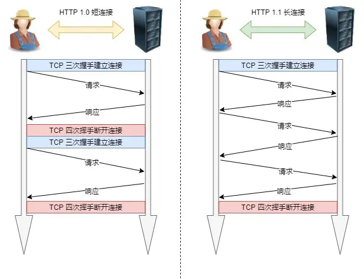

第二个是管道网络传输，同样可以用图：

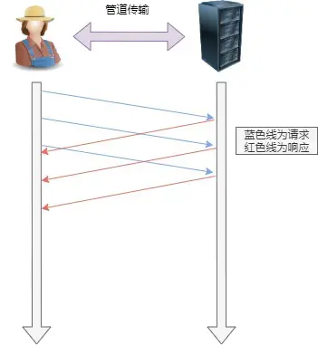

但是这有两个问题：一个是服务器必须根据接收顺序处理对应请求；另一个就是管道网络传输解决了客户端的队头堵塞但是没有解决服务端的队头堵塞。

另外管道化技术不是默认开启的，且大多数浏览器没有支持，目前也没有多少人用。

#### HTTP和HTTPS

##### 区别和HTTPS解决了哪些问题

HTTPS目的在于解决HTTP不安全的缺陷，它通过在HTTP层和TCP层间加入SSL/TLS层来实现报文的加密传输，另外通过向CA申请数字证书保证服务器的身份是可靠的。

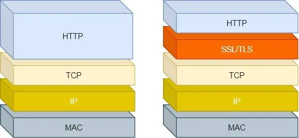

有几个措施我们要关注一下：

- 通过混合加密，实现了数据不会被窃听
- 通过摘要算法，实现了保证数据完整性
- 通过数字证书，实现了服务器不会被冒充

接下来详细说说这三个方法：

###### 混合加密

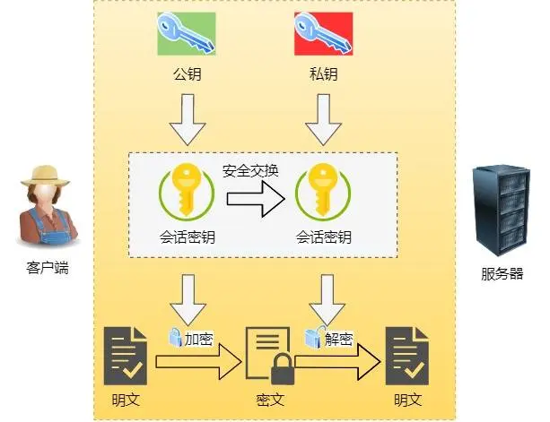

混合加密由两部分组成：
- 对称加密：只使用一个密钥，运算快，密钥必须保密、无法交换密钥
- 非对称加密：使用公钥和私钥，公钥可以随意分发私钥保密、解决了密钥交换问题，但是速度慢

HTTPS混合加密的步骤是：
- 在通信建立前，使用非对称加密交换会话密钥
- 在通信过程中，使用会话密钥加密明文数据

一句话：公钥和私钥是客户端和服务端建立连接，确定“暗号”会话密钥、会话密钥是用来加密数据

###### 摘要算法

为了保证数据不被更改，需要对内容计算出一个“指纹”，然后传给对方，对方也对内容计算一个指纹，指纹相同则内容未被篡改。

通常使用哈希算法算出的哈希值作为指纹，可以确保内容本身不被篡改，但是不能保证 “内容+哈希值” 这个整体不被替换，还是缺少客户端收到的信息是否来自服务端的凭证。

此时可以通过非对称算法来解决：

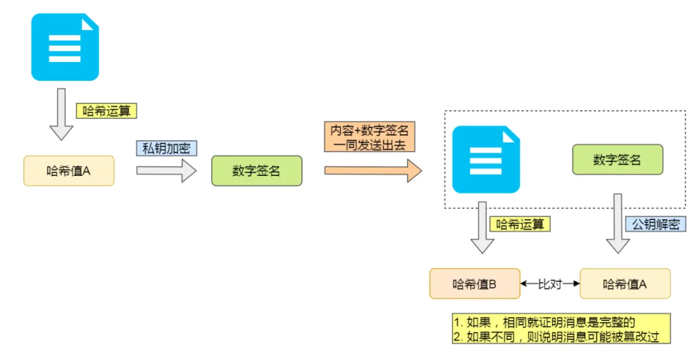

###### 数字证书

前面，我们实现了：
- 通过哈希算法保证内容没问题
- 通过非对称算法算出的数字签名保证信息是由私钥一方发送的

但是通过自己伪造一对公私钥，还是可以作乱。也就是，还缺少身份验证的环节。

此时引入“第三方”CA来颁发数字证书来保证身份，依旧上图：

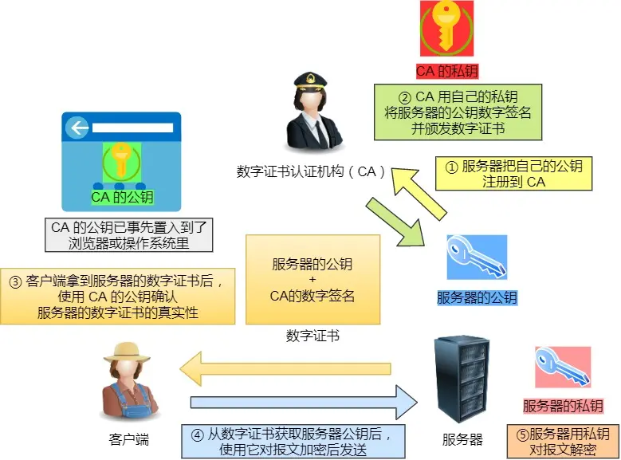

也就是你自己伪造的“身份证”通不过“警察局”的检查。

##### HTTPS是怎么建立连接的

HTTPS在TCP三次握手前，还需要经过TLS的握手。基本流程如下：
- 客户端向服务器索要并验证服务端的公钥
- 双方协商产生会话密钥
- 采用会话密钥实现加密通信

前两步就是TLS的握手阶段。

TLS的握手阶段涉及四次通信，使用不同的密钥交换算法，握手的步骤也不一样，目前主流的两种密钥交换算法有两种：RSA算法和ECDHE算法，这里先简单看看RSA算法是怎么工作的，后续会详细介绍这两种算法：

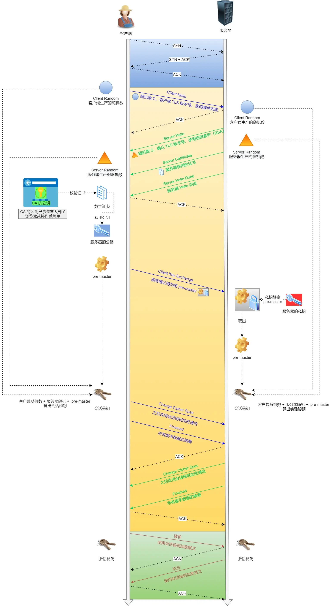

接下来是数字证书的签发和验证流程：

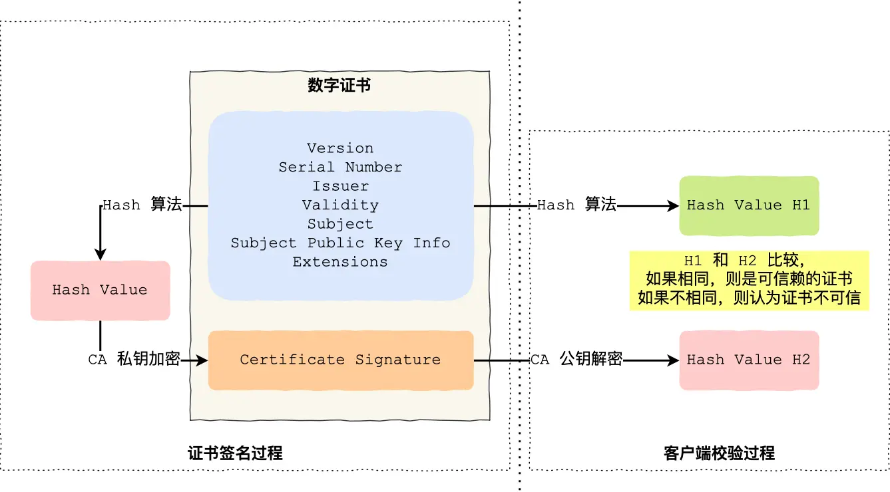

另外，在证书的验证过程中还有另外一个问题，就是证书的信任链，向CA申请的证书一般不是根证书，而是通过信任链来保证证书的合法性和隔离性：

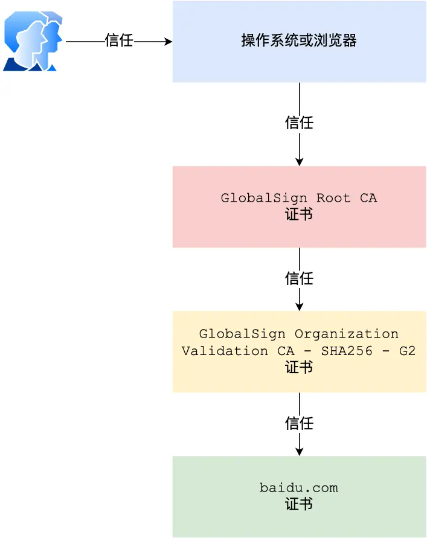

##### HTTPS的应用数据如何保证完整的

TLS协议在实现上分为握手协议和记录协议两层，握手协议如上面所说，用于加密数据；而记录协议目的在于保护数据内容以及验证其来源。

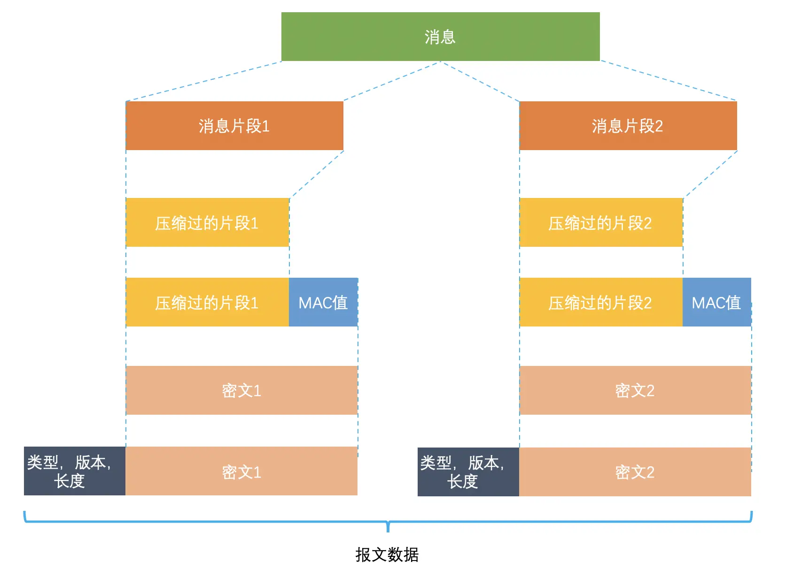

TLS记录协议过程如上图，具体如下：

- 消息被分割为多段后被压缩
- 每个片段上加上消息认证码（图中MAC值，通过哈希算法得出），用于保证完整性和认证数据
- 每一段通过对称密码进行加密
- 每一段加上报头，集合即为最终数据

记录协议完成后，数据转交给TCP进行传输。

##### HTTPS一定是安全可靠的吗

目前来说HTTPS没有协议层面上的漏洞。

#### HTTP/1.1、HTTP/2.0、HTTP/3.0 演变

##### HTTP/1.1相比与HTTP/1.0提高了什么性能

性能上的改进：
- 使用长连接减少了性能开销
- 支持管道网络传输

1.1的不足之处：
- 请求/响应头部不能压缩，头部越大延迟越大，只有body能压缩
- 服务器的队头阻塞问题
- 无请求优先级的控制
- 请求只能从客户端开始

##### HTTP/2 做了哪些优化

HTTP/2是基于HTTPS的，所以安全性上有保障：

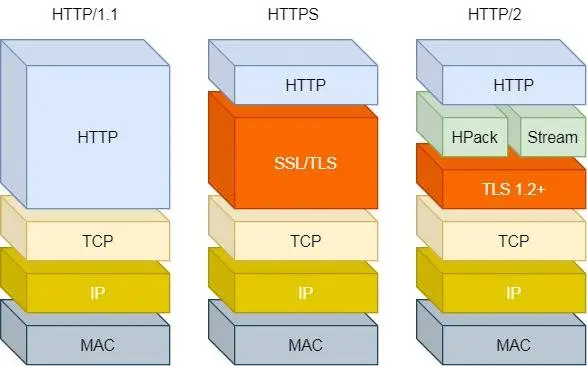

它相对于1.1做了以下改进：

- 头部压缩：通过HPack进行头部压缩，在客户端和服务器同时维护一张表，字段存入表中生成对应索引号，有重复的部分可以直接发送对应索引号。
- 二进制格式：不像1.1的纯文本报文，2将头信息和数据体都采用了二进制格式，称为头信息帧和数据帧，可读性不如纯文本，但是传输效率高
- 并发传输：1.1的实现是基于“请求-响应”的，完成一个过程才能进行下一个过程，所以会造成队头堵塞；2采用了Stream概念，通过多个Stream复用一条TCP连接，实现将数据拆分成帧，后通过Stream ID合并成完整数据，实现并行交错地发送请求和响应
- 服务器推送：客户端和服务器双方都能建立Stream，服务端可以实现主动推送

但是2还是有缺陷。

2通过Stream的并发能力解决了1队头阻塞的问题，但实际上在TCP层还是存在队头阻塞的问题：

**HTTP/2 是基于 TCP 协议来传输数据的，TCP 是字节流协议，TCP 层必须保证收到的字节数据是完整且连续的，这样内核才会将缓冲区里的数据返回给 HTTP 应用，那么当「前 1 个字节数据」没有到达时，后收到的字节数据只能存放在内核缓冲区里，只有等到这 1 个字节数据到达时，HTTP/2 应用层才能从内核中拿到数据，这就是 HTTP/2 队头阻塞问题。**

举例如下图：

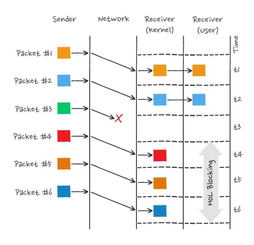

P3丢失了，即使收到了4-6，但TCP数据不连续，所以只能读到1-2，只有当P3重传后，接收方的应用层才能从内核中读到数据。

所以一旦丢了包，就触发了TCP的重传机制，那么，在一个TCP连接中的**所有HTTP请求**都必须等待这个丢了的包重传回来。

##### HTTP/3 做了哪些优化

前面我们知道了1.1和2都有队头阻塞的问题：
- 1.1的管道方案解决了发送端的阻塞问题但是没有解决响应端的队头阻塞，只有等响应完这个请求后才能处理下一个请求，属于HTTP层的队头阻塞
- 2通过多个请求复用一个TCP连接解决了HTTP层的队头阻塞，但一旦丢包，就会阻塞住所有的HTTP请求，属于TCP层的队头阻塞

HTTP/3解决2的TCP队头阻塞方式很简单粗暴——**直接将TCP改为UDP**：

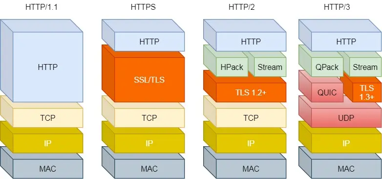

UDP协议不管顺序也不管丢包，自然就不会出现队头阻塞。但它毕竟是不可靠传输。

但是基于UDP的QUIC协议可以实现类似于TCP的可靠传输，QUIC有以下几个优点：

- 无队头阻塞：QUIC协议中，当某个流丢包时，只会阻塞这个流而不影响其它流，所以不存在队头阻塞问题。
- 更快建立连接：对于HTTP/1.1、HTTP/2中TCP和TLS是分层的，且难以合并，所以得分批次握手；而QUIC中包含了TLS，只需要通过一次QUIC三次握手就能实现建立连接和密钥协商
- 连接迁移：基于TCP协议的HTTP协议是通过四元组（源IP、源端口、目的IP、目的端口）确定一条TCP连接，在一些情况下，例如移动设备的网络从4G到WIFI时意味着IP变化，则必须断连后重连，连接的迁移成本非常高；QUIC通过连接ID标记连接的两个端点，在保有上下文信息时，实现了连接迁移

所以一句话：QUIC是建立在UDP基础上的伪 TCP+TLS+HTTP/2 的多路复用的协议。

QUIC是新协议，很多设备会将其认为是UDP导致出问题；HTTP/3仍在普及中。或许在这篇文章后的5年内，HTTP/2会变成互联网legacy。

**OK，HTTP的常见内容就是上面这些，下面是对其中的一些的问题进行更详细的阐述或者复述/总结。**

### HTTP/1.1如何优化

在思考怎么优化HTTP/1.1时，我们可以从这几个方向出发：

- 尽量少发HTTP请求
- 在发送HTTP请求时，考虑怎么减少请求次数
- 减少服务器的HTTP的响应数据的大小

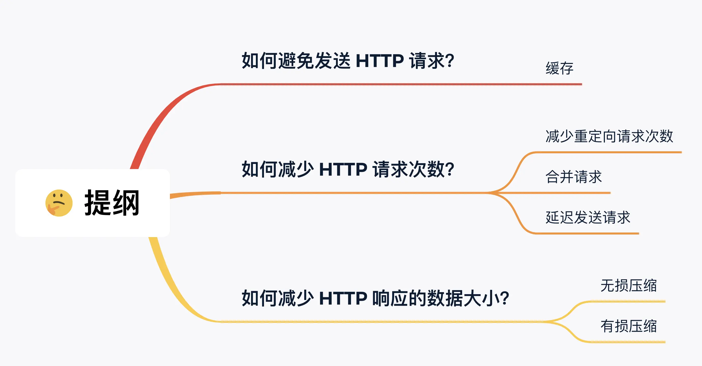

接下来，看看这些思路具体有哪些优化方法：

#### 怎么少发HTTP请求

缓存请求-响应到本地，通过cache-control或Etag判断缓存内容是否为最新。这个无需多讲

#### 如何减少请求次数

可以从三个方面入手：

- 减少重定向请求
- 合并请求
- 延迟发送请求

##### 减少重定向

服务器上的一个资源可能由于迁移、维护等原因从 url1 移至 url2 后，而客户端不知情，它还是继续请求 url1，这时服务器不能粗暴地返回错误，而是通过 302 响应码和 Location 头部，告诉客户端该资源已经迁移至 url2 了，于是客户端需要再发送 url2 请求以获得服务器的资源。

重定向请求越多，需要发送的请求越多。

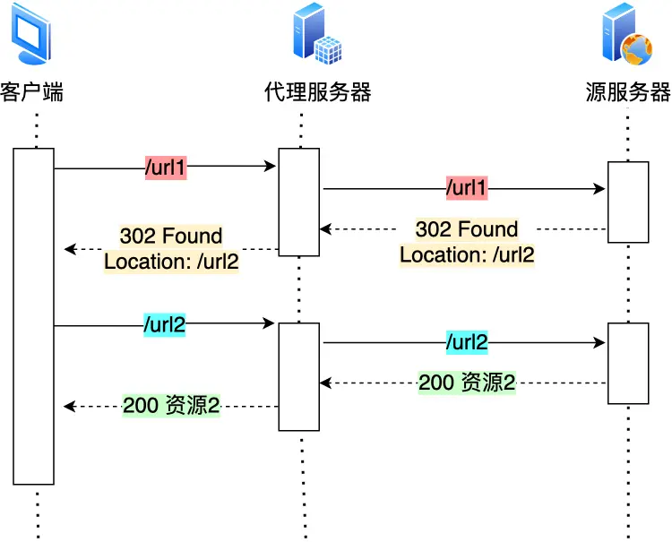

这时可以使用代理服务器，将重定向的工作交由它完成：

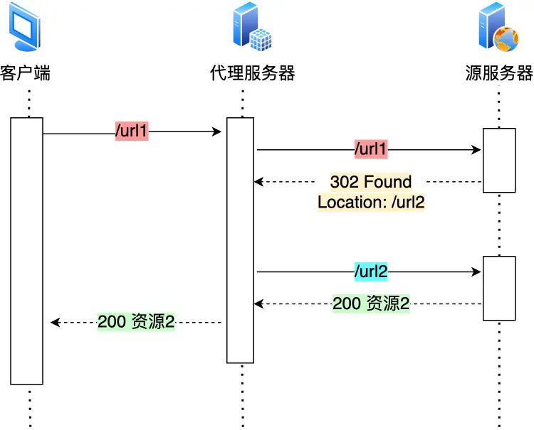

##### 合并请求

我们可以将访问多个小文件的请求合为一个大请求，减少了重复发送的请求头部，另一方面是减少了TCP连接的数量。

常见的一个方案就是雪碧图，将n个小图改为请求一个大图，之后再做分割。

> 但这也有一个弊端，如果某个小资源要修改，客户端得重新下载整个完整的大资源文件

##### 延迟发送请求

按需获取，懒加载，这都可以用到延迟发送请求，而不是一开始就请求所有资源

#### 如何减少HTTP响应的数据大小

减小大小自然会想到压缩。一般有两种方式：

- 无损压缩
- 有损压缩

##### 无损压缩

无损压缩是指资源经过压缩后，信息不被破坏，还能完全恢复到压缩前的原样，适合用在文本文件、程序可执行文件、程序源代码。

一般的无损压缩步骤是先根据语法规则进行压缩，之后根据霍夫曼算法做统计模型，后面服务器根据HTTP头部中的 Accept-Encoding 提供的支持压缩格式选择一个压缩算法进行压缩，最后通过响应头的 Content-Encoding 告诉请求方用了哪种压缩算法从而解压缩。

##### 有损压缩

与无损压缩相对应的就是有损压缩，经过此方法压缩，数据与原数据不同但是近似

有损压缩主要将次要的数据舍弃，牺牲一些质量来减少数据量、提高压缩比，这种方法经常用于压缩多媒体数据，比如音频、视频、图片。

当数据很多或者很大时，要选择合适的压缩格式来提高性价比。

### HTTP ECDHE 握手解析

ECDHE 的核心在于“交换参数，各自计算”。

1.  **Client Hello**: 客户端发送它支持的 TLS 版本、密码套件列表以及一个 **Client Random**（随机数）。
2.  **Server Hello**: 服务端选择加密套件，发送 **Server Random** 和 **Certificate**（证书）。
3.  **Server Key Exchange (关键步)**: 
    * 服务端生成一对临时椭圆曲线密钥（私钥 $d_S$ 和公钥 $Q_S$）。
    * 服务端发给客户端：**椭圆曲线参数** + **服务端公钥 $Q_S$**。
    * 为了防止伪造，服务端会用自己的 RSA/ECDSA 私钥对这些数据进行**签名**。
4.  **Client Key Exchange**: 
    * 客户端校验签名后，也生成一对临时密钥（私钥 $d_C$ 和公钥 $Q_C$）。
    * 客户端发给服务端：**客户端公钥 $Q_C$**。
5.  **生成会话密钥**:
    * 此时，双方都拥有对方的公钥和自己的私钥。根据 ECDH 算法，双方能算出一个相同的 **Pre-Master Secret**（预主密钥）。
    * 结合 Client Random + Server Random + Pre-Master Secret，最终生成**对称加密密钥**。
6.  **Finished**: 双方发送加密的确认消息，握手结束。

在 RSA 握手时代，客户端直接用服务端的公钥加密 Pre-Master Secret 发给对方。这存在一个致命伤。

前向安全性，这是 ECDHE 的王牌。
* **RSA 的风险**: 如果黑客录制了你今天的加密流量，并在此后的某一天偷到了服务器的**私钥**，他就能解开过去所有的历史报文。
* **ECDHE 的优势**: 握手中使用的 $d_S$ 和 $d_C$ 都是**临时生成的**，握手结束即销毁。即使服务器私钥泄露，黑客也无法通过它推导出当时的临时密钥，因此**无法破解历史流量**。

ECDHE的性能优势：
* **短小精悍**: 256 位的椭圆曲线密钥安全性等同于 3072 位的 RSA 密钥。
* **计算效率**: 随着安全等级提升，RSA 的计算开销呈指数级增长，而 ECC（椭圆曲线）的增长平缓得多，更适合移动端和高并发场景。

> **💡 一句话总结**：RSA 是“公钥加密解密”，ECDHE 是“公钥签名证明身份，临时密钥交换保护隐私”。

### HTTPS 如何优化

HTTPS相对于HTTP多了一个TLS握手过程，这个过程最长会花掉2 RTT，故而对它进行优化非常重要，可以从以下多个角度分析和优化HTTPS：

#### 分析性能损耗

既然要优化，就需要先找出有性能损耗的部分，分析得有两个产生性能损耗的环节：

- 第一个环节：TLS握手过程
- 第二个环节：握手后的对称加密报文传输

对于第一个环节，TLS握手过程增加了网络延时且握手过程中的一些步骤会产生性能损耗，如：对于ECDHE算法再握手过程中客户端服务端都需要临时生成公私钥、客户端验证证书时需要查询服务端的证书是否被吊销、双方还需要计算pre-master等等。

第二个环节，目前的对称加密算法性能都不错且CPU做了专门的性能优化，这个环节的损耗很小。

接下来说说优化的几种方案：

#### 硬件优化

简单粗暴地堆料，花钱买性能，这里具体不做阐述。

#### 软件优化

如果是新服务器可以考虑买更好的硬件，但是对于已经投入生产中的服务器来讲，从软件方向优化是比较实际的。软件优化有两个方向：一个是软件升级、一个是协议优化。

对于软件升级，很好理解，软件提供者会提供最新特性和优化软件问题和性能。但是对于大公司来说实现大规模地软件升级也不容易。

#### 协议优化 

协议优化改动相对较小，实际上就是对密钥交换算法地优化，简而言之就是从RSA换成ECDHE，另外就是升级TLS协议

#### 证书优化

对于证书优化有两个方向：
- 证书传输过程
- 证书验证过程

对于证书传输，我们可以采用更小的证书，例如使用ECDSA证书替换RSA证书，保证相同安全强度下的更小体积。

对于证书验证，我们知道客户端验证证书比较麻烦，要从证书信任链逐层查询、要使用CA公钥解密证书、要用签名算法验证证书的完整性、要通过下载CA提供的CRL或者OCSP数据了解证书是否被吊销等等。这个访问过程是HTTP访问，会产生网络通信的开销：我们讲讲CRL和OCSP：

CRL是证书吊销列表，由CA定期更新，服务器证书在此列表则认为已经失效。但是它有两个缺点：实时性差、列表逐渐变大导致下载太慢。

因此现在基本采用OCSP：名为在线证书状态协议，工作方式就是向CA发送查询请求，返回证书有效状态，解决了CRL的问题，不过得看CA服务器是否稳定。

为了解决这个网络开销，又出现了OCSP Stapling，原理是服务器周期性查询CA证书状态，带一个时间戳和签名的响应结果，并缓存它，用于在TLS握手过程中发送给客户端。

#### 会话复用 

TLS握手的目的就是协商会话密钥，我们可以通过缓存第一次握手协商的密钥，之后复用它来减少TLS握手损耗。

这就是会话复用，它有两种方式：

- 第一种是 session ID，它的工作原理是客户端服务器首次TLS握手后，双方在内存缓存会话密钥，并用session ID标识，session ID和会话密钥相当于key-value的关系
  - 缺点是服务器可能需要存多个客户端的session ID，内存压力变大；另外现在网站服务一般由多个服务器负载均衡完成，再次连接不一定命中上一次的服务器，于是还要走TLS的握手过程
- 第二种是 session Ticket，为了解决session ID的问题，服务器不再缓存，而是交给客户端

简而言之有点像：session ID是服务器给客户端办了个卡；session Ticket是客户端给服务器一张加密的门票。

### HTTP/2 的一些细节

HTTP/1.1存在一些问题：

- 延迟难以下降
- 并发连接有限
- 队头阻塞
- HTTP头部巨大且重复
- 不支持服务器推送

对于其中的部分问题可以使用一些优化方法来解决：
- 例如用雪碧图、图片二进制化减少请求数
- 将一个页面的资源分散到不同的域名，提升并发连接上限
- ···

但对于一些地方没办法做优化，例如请求-响应模型的局限性、头部的问题、服务器不能推送等等，这些要改变，就只能从协议上做修改，于是提出了HTTP/2，它做了这些工作：

#### 兼容HTTP/1.1

为了兼容1.1版本，2做了这些工作：

- HTTP/2没有在URL中引入新的协议名，使用 http 表示明文协议，引入了 https 表示加密协议，这样只需要浏览器/服务器在后台自动升级协议，而不需要增加用户的负担
- 只在应用层上做了改变，将HTTP分为了语义和语法两部分，语义层没有改动，与1.1完全一致，例如请求方法、状态码等等规则都不变

但是在“语法”层面上做了很多改造，基本上改变了HTTP报文的传输格式。

#### 头部压缩

HTTP/1.1中Header部分存在这些问题/可优化的地方：
- 存在很多固定/重复的字段如Cookie、Accent等，有必要压缩，以及减少字段的重复性
- 字段为ASCII编码，易读但效率低。

而HTTP/2是这么压缩头部的，它采用了HPACK算法，这个算法由三部分组成：
- 静态字典
- 动态字典
- 压缩算法

总体的思路是客户端和服务器两边建立和维护一个“字典”，用索引号来表示重复的字符串，然后用压缩算法（哈夫曼算法）来压缩数据后再发送。

HTTP/2为高频出现在头部的字符串和字段建立了一张静态表，有61组：

可以看到是 `index-name-value` 的格式，其中value为空是因为它们并不固定，而是需要经过哈夫曼算法编码后得到。

最后，可以得到一段二进制数据，表示对应的静态头部。

动态表用于扩充静态表，Index从62起步，存放不在静态表范围内的字符串。不过为了防止“字典”无限增大，服务器提供了 http2_max_requests 配置。

#### 二进制帧

HTTP/2将HTTP/1的文本格式改为了二进制格式传输数据，从下图可以看出HTTP/1.1的响应和2的区别：

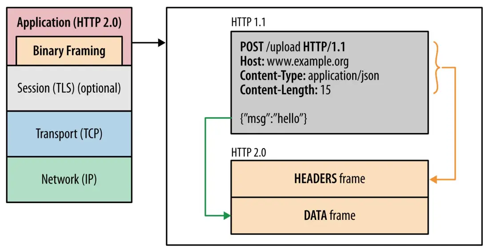

我们可以注意到，HTTP/2将响应报文分成了HEADERS和DATA帧，下面两张图展示的是HEADERS帧的构成：

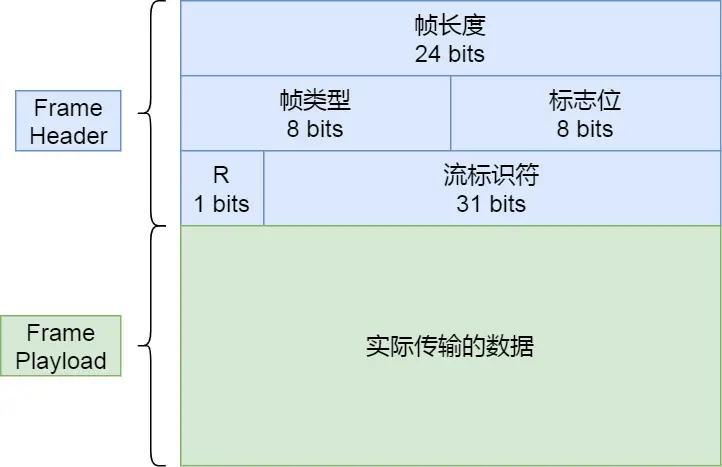

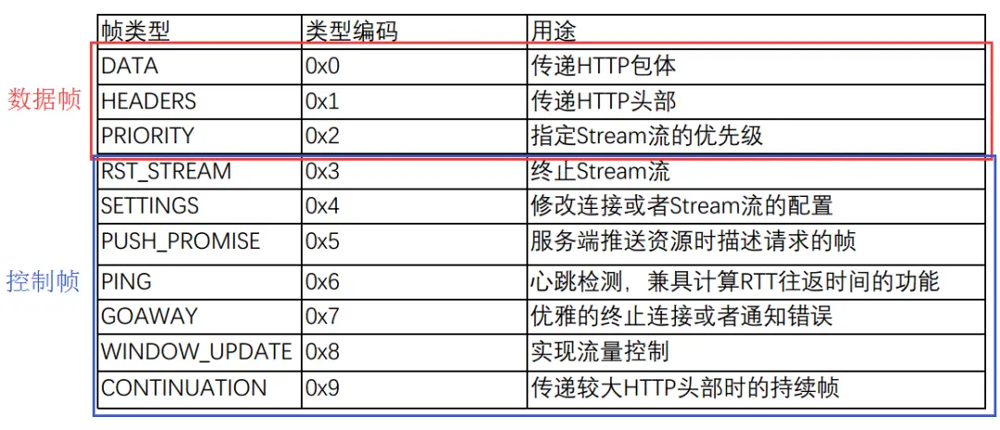

帧数据则存放HPACK压缩后的HTTP头部和包体。

#### 并发控制

HTTP/2通过多个Stream复用一条TCP连接实现并发：

- 一个TCP连接包含一个/多个Stream
- 一个Stream包含一个/多个Message，对应HTTP/1中的请求或者响应，由HTTP头部和包体构成
- 一个Message里包含一条或者多个Frame，它是HTTP/2最小单位，以二进制压缩格式存放HTTP/1中的内容

不同Stream中的帧可以乱序发送（帧通过头部携带Stream ID信息便于接收端组装信息），同一Stream的帧必须严格有序。这样就实现了并发。

客户端和服务器双方都可以建立Stream，以实现服务端主动推送。但是客户端建立的Stream必须是奇数号，服务端则必须为偶数号。

#### 服务端主动推送

服务器在主动推送资源时，会通过 PUSH_PROMISE 帧传输 HTTP头部，并通过帧中的 Promised Stream ID 字段告知客户端，接下来会在哪个偶数号Stream中发送包体，如下图：

### HTTP/3 的一些细节

HTTP/2有这么一些不足之处：
- 没有解决TCP的队头阻塞
- TCP与TLS的握手延迟
- 网络迁移需要重新连接

简而言之，HTTP/3是通过将TCP协议替换为基于UDP的QUIC协议来解决这些问题：

- QUIC协议有类似于HTTP/2 Stream与多路复用的概念，可以防止队头阻塞，如果一条Stream上的包丢失也不影响其它Stream中的包传输
- QUIC内部包含了TLS，且采用的是更先进的TLS 1.3，优化了握手延迟
- QUIC通过使用连接ID替换TCP中的四元组，实现了连接迁移

另外，对于HTTP本身，HTTP/3也做了一些改进：

首先是帧格式的修改：

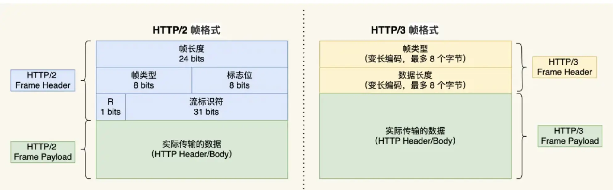

根据帧类型大体上分为数据帧和控制帧。

然后，头部压缩算法由HPACK修改为了QPACK，使用的还是静态表、动态表和哈夫曼编码。QPACK的静态表扩到了91项；且动态表的解码方式发生改变，QUIC使用了两个单项流保证双方的动态表同步，防止了未同步导致的无法解码问题。

### 为什么有RPC

TCP是在七十年代出来的，它解决了“怎么传”的问题，但是直接用裸TCP的话会有这么几个问题：
- 粘包问题：TCP是基于字节流的，也就是说所有的请求都合在一起用一串二进制码发送，接收方无法判断信息的界限
- 无语义：TCP头只有端口和序列号，但是没有语义以描述请求的意图
- 太过底层：直接使用TCP需要自己写一套加密、压缩、分块传输等等等的逻辑，非常复杂

所以我们需要基于TCP来做另一套协议，也就是HTTP、基于RPC的协议等等

RPC（Remote Procedure Call），远程过程调用。它本身不是一个具体协议，而是一种调用方法：远端服务器暴露一个方法出来，本地可以直接调用，且能屏蔽一些网络细节，非常方便。

于是基于这个思路，衍生出了非常多基于RPC的协议，如gRPC、thrift等

RPC是八十年代的，HTTP是九十年代的，所以我们可以理解了，为什么有RPC。

OK，那为什么有HTTP呢？

对于电脑中的联网软件，它们作为客户端（Client）需要跟服务端（Server）连接，收发信息，在这种C/S架构下，使用RPC无可厚非。

但是对于浏览器，它们需要访问各种服务器，因此它们需要一个统一的标准，而不是各个公司自己造出来的RPC。于是在这种B/S架构下，HTTP自然出现。

### 为什么有WebSocket？

怎么样才能在用户不做任何操作的情况下，网页能收到消息并发生变更？

最常见的解决方案是，网页前端代码使用定时轮询。但是有俩问题：消耗带宽、可能导致卡顿。

更好的解决方案有两种，一个是长轮询、一个是WebSocket。

长轮询是这样的：客户端发起请求，服务器收到后不立刻响应，而是挂起，直到有新数据产生或者连接超时，服务器才响应。可以实现类似即时的效果。不过它占用了服务器的资源，且本质上还是客户端主动去取数据。

接下来说说WebSocket，我们知道TCP是全双工的，也就是同一时间里，双方可以主动向对方发送数据。但是HTTP/1.1是半双工的，于是WebSocket出现了，用于实现全双工。

它经历三次TCP握手后，由HTTP协议升级：

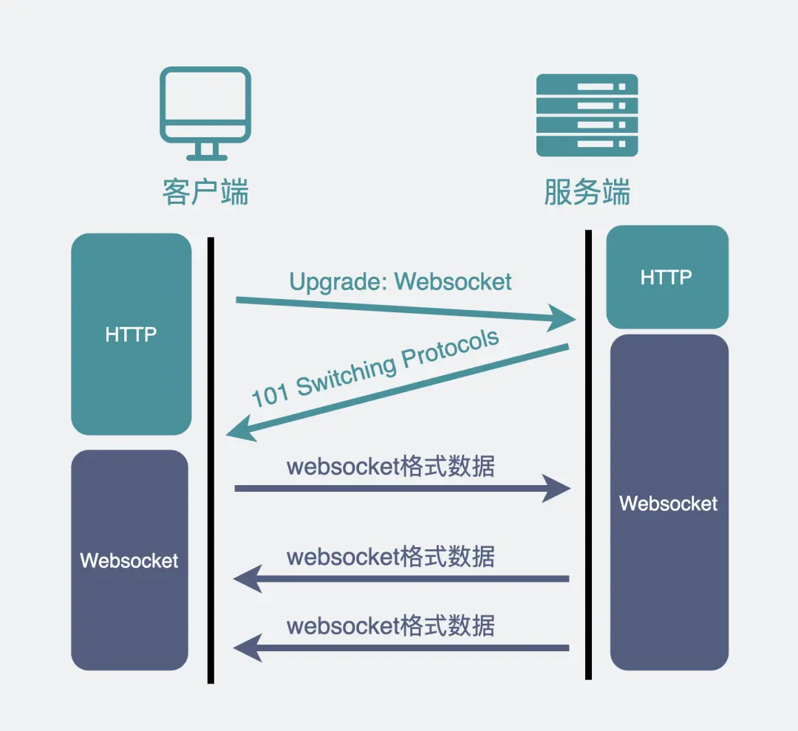

WebSocket主要用于需要两端需要频繁交互的大部分场景。

## TCP/UDP篇

