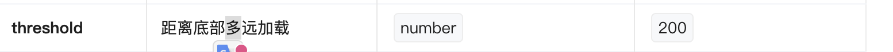

GPT image-2 现在可以直接生成可编辑的 psd 文件，现阶段生成的psd文件可能不会很精细，分层或许不太精确。

桩文件的作用，是在开发阶段用一层很薄的代理代码，替代真正完整编译后的产物，从而减少反复构建的成本。正常情况下，一个包改了源码后，如果每次都先完整打包再给别的项目使用，开发效率会比较低；而桩文件可以让入口路径保持不变，但实际运行时再去加载最新的 src 源码，这样改完代码后能更快看到效果，也方便多包联调。它本质上更偏向“开发态优化”，不是面向浏览器生产环境的最终代码。因为这类文件常常依赖动态加载、top-level await、甚至 Node 内建模块，所以在 Node 环境下很好用，但如果被前端构建链误当成正式运行时代码，就可能出现兼容性题。简单说，桩文件是为了提升开发联调效率而存在的代理文件，不是最终交付物。

L站发了个帖子小火了一下：https://linux.do/t/topic/2067529/5

什么是KYC
> KYC（Know Your Customer）就是「了解你的客户」，是金融机构验证用户真实身份的流程。你注册银行、开证券账户、用支付宝大额转账时，要上传身份证、做人脸识别、填个人信息，这些都属于 KYC。它的目的是防洗钱、防欺诈、反恐怖融资——各国法律都强制要求金融机构在开户前确认「你到底是谁」。KYC 一般分等级，初级只验手机号，中级要身份证，高级还要地址和收入证明，等级越高能用的功能越多。现在不光银行，交易所、支付平台、甚至 AI 服务（比如 Claude）也都开始做 KYC，本质上是监管越来越严，平台必须对用户身份负责。

今天用了一天micu的gpt-5.4 xhigh中转，只花了不到三块，但是效果比minimax好的多，不知道是因为模型还是codex的功劳。codex体感上真的比claudecode用着舒服，写代码前会跟你确定需求，改完后还会做回归测试。

https://linux.do/t/topic/2004814 一些SDD相关的skills

神了，说明和实际上的功能不一样，这实际上是下拉刷新的高度

测试一个前端项目的几个维度：
1. **UI 视觉** — 样式、布局、响应式、设计稿还原
2. **功能正确性** — 正常流程、边界情况、异常处理
3. **交互体验** — 点击反馈、键盘操作、手势、动画
4. **数据与接口** — 接口联调、空数据、错误处理、缓存
5. **兼容性** — 浏览器、设备、系统版本
6. **性能** — 加载速度、内存、卡顿、包体积
7. **网络** — 弱网、断网、超时重试
8. **安全** — XSS、越权、敏感信息
9. **可访问性** — 屏幕阅读器、键盘导航、对比度

后端测试维度：
1. **功能正确性** — 接口逻辑、业务规则、数据处理
2. **数据完整性** — CRUD 操作、事务、数据一致性
3. **接口规范** — 请求/响应格式、状态码、错误码
4. **权限与安全** — 认证、授权、注入攻击、数据脱敏
5. **性能** — 响应时间、并发能力、资源占用
6. **稳定性** — 异常恢复、熔断降级、限流
7. **兼容性** — 版本兼容、数据迁移、向前/向后兼容
8. **可观测性** — 日志、监控、链路追踪

